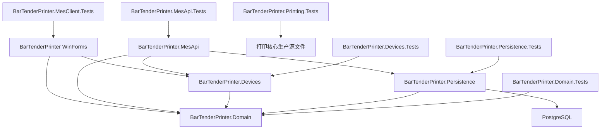

# 系统架构

## 当前结构

## 项目职责

| 项目 | 目标框架 | 职责 |
|---|---|---|
| BarTenderPrinter | net8.0-windows | WinForms 工位、BarTender COM、模板、打印和本地历史 |
| BarTenderPreviewHost | net48 | 隔离调用 BarTender SDK 导出预览 |
| BarTenderPrinter.Domain | net8.0 | 跨平台领域模型与共享契约 |
| BarTenderPrinter.Devices | net8.0 | 设备适配器边界 |
| BarTenderPrinter.Persistence | net8.0 | 中心持久化边界 |
| BarTenderPrinter.MesApi | net8.0 | ASP.NET Core 中心服务入口 |
| BarTenderPrinter.Domain.Tests | net8.0 | 跨平台领域契约测试 |
| BarTenderPrinter.Devices.Tests | net8.0 | 模拟电子称与模拟写号适配器状态测试 |
| BarTenderPrinter.Printing.Tests | net8.0 | 跨平台打印账本、模板解析和幂等测试 |
| BarTenderPrinter.MesClient.Tests | net8.0 | MES 客户端重试、脱敏、断线意图保留和恢复测试 |
| BarTenderPrinter.Persistence.Tests | net8.0 | PostgreSQL 迁移、并发、幂等和审计集成测试 |
| BarTenderPrinter.MesApi.Tests | net8.0 | MES API 身份、角色、验证、查询和幂等集成测试 |
| BarTenderPrinter.Tests | net8.0-windows | 现有客户端与打印业务测试 |

## 当前实现状态

中心服务提供 `/health`、订单与号段、事务号码申请、组装过站、包装绑定、打印作业、质量检验与处置、返工、出库、归档及统一追溯端点。API 使用配置驱动的 Bearer 工位会话、角色策略、白名单输入验证、统一错误契约和关联 ID。`StationSessionFilter` 在受保护端点执行前统一校验用户、角色、工位和班次，并将不可变会话上下文提供给业务处理与审计。`AuditSnapshot` 统一生成主体、工位、班次、关联 ID 和前后快照，并递归脱敏 IMEI、SN 与设备诊断。

WinForms 主窗口新增 `MES 工位` 页面，包含连接设置、订单查询、组装过站、包装过站、MES 打印、追溯与人工核查。`MesApiClient` 为 GET 和带幂等键的 POST 提供有限重试，并保持关联 ID 与幂等键稳定；日志隐藏查询值和访问令牌。在线校验操作先保存本地业务意图，断线时返回 `ONLINE_VALIDATION_REQUIRED`。打印作业保留本地和中心结果快照，恢复时按原幂等键查询中心状态，并标记为 `Synced` 或 `ReviewRequired`。

设备项目定义电子称和写号边界，并提供支持稳定读数窗口、结构化连接错误、执行超时和回读校验的可配置模拟实现。领域与中心持久化覆盖质量抽检、质量处置、返工审批和路线关闭、出库扫描与数量确认、订单不可变归档。PostgreSQL 迁移当前为 v9；服务在映射端点前运行迁移。v8 增加跨订单样本约束、质量冻结原状态、返工过站上下文外键、状态命令幂等和归档数据库不可变保护，v9 清理历史跨订单样本并写入修复审计。统一追溯响应在原有生产、过站、包装、打印和审计履历上增加检验批、检验结果、处置、返工、出库及归档记录。

## 边界原则

- 中心服务负责跨工位一致性和企业追溯。
- WinForms 客户端负责扫码交互、BarTender 提交和本地恢复。
- 本地 SQLite 打印账本在 BarTender 提交前保存不可变请求和摘要，同键请求只产生一次提交意图。
- PostgreSQL 是中心权威存储，使用唯一索引、事务行锁、幂等摘要和乐观并发版本维护跨工位一致性。
- PostgreSQL 迁移在事务级 advisory lock 内顺序执行，支持多服务实例安全启动。
- 设备能力通过 `BarTenderPrinter.Devices` 隔离。
- 需要中心规则判定的过站和包装操作保持在线校验语义；断线业务意图仅进入本地待处理存储。
- 质量失败会冻结关联包装层级；放行处置恢复冻结包装，待处置质量冻结阻止出库扫描。
- 订单归档要求订单已关闭，并保存带 SHA-256 摘要的完整追溯 JSON 快照。
- MobileMes 旧 DLL、程序、证书、数据库和日志不进入新项目制品。
