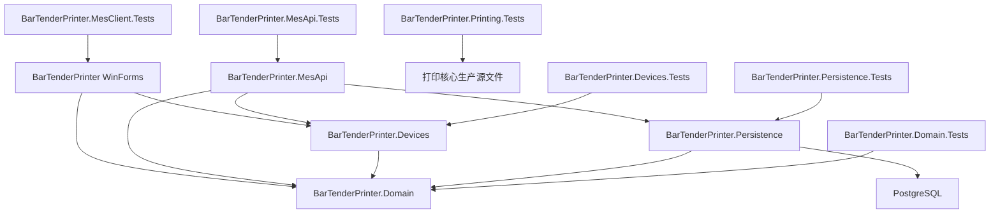

# 系统架构

## 当前结构

## 项目职责

| 项目 | 目标框架 | 职责 |
|---|---|---|
| BarTenderPrinter | net8.0-windows | MIUIX WinForms 打印与 MES 工位、BarTender COM、模板、本地历史和操作恢复 |
| BarTenderPreviewHost | net48 | 隔离调用 BarTender SDK 导出预览 |
| BarTenderPrinter.Domain | net8.0 | 跨平台领域模型与共享契约 |
| BarTenderPrinter.Devices | net8.0 | 电子称与写号真实适配接口及首期模拟适配器 |
| BarTenderPrinter.Persistence | net8.0 | PostgreSQL 16 中心持久化、CSV 交换和归档修复 |
| BarTenderPrinter.MesApi | net8.0 | ASP.NET Core 中心服务入口 |
| BarTenderPrinter.Domain.Tests | net8.0 | 跨平台领域契约测试 |
| BarTenderPrinter.Devices.Tests | net8.0 | 模拟电子称与模拟写号适配器状态测试 |
| BarTenderPrinter.Printing.Tests | net8.0 | 跨平台打印账本、模板解析和幂等测试 |
| BarTenderPrinter.MesClient.Tests | net8.0 | MES 客户端重试、脱敏、断线意图保留和恢复测试 |
| BarTenderPrinter.Persistence.Tests | net8.0 | PostgreSQL 迁移、并发、幂等和审计集成测试 |
| BarTenderPrinter.MesApi.Tests | net8.0 | MES API 身份、角色、验证、查询和幂等集成测试 |
| BarTenderPrinter.Tests | net8.0-windows | 现有客户端与打印业务测试 |

## 当前实现状态

中心服务提供 `/health`、订单创建查询与状态转换、号段申请与号码状态历史、生产单元/路线/工位/包装主数据、组装过站、包装绑定、称重规则与测量、写号任务、打印作业、质量检验与处置任务、返工、出库、归档校验修复、CSV 导入导出及统一追溯端点。API 使用配置驱动的 Bearer 工位会话、角色策略、白名单输入验证、统一错误契约和关联 ID。`StationSessionFilter` 在受保护端点执行前统一校验用户、角色、工位和班次，并将不可变会话上下文提供给业务处理与审计。`AuditSnapshot` 统一生成主体、工位、班次、关联 ID 和前后快照，并递归脱敏 IMEI、SN 与设备诊断。

MIUIX WinForms `MES 工位` 页面由七个一级分组组成：订单、主数据、生产工位、质量返工、出库归档、导入导出、作业与恢复。页面覆盖订单状态、生产单元/路线/工位/包装主数据、号码状态、组装与包装、称重、写号、质量处置任务、返工、出库、归档修复、CSV 批次、MES 打印、追溯和操作恢复。`MesApiClient` 为 GET 和带幂等键的 POST 提供有限重试，并保持关联 ID 与幂等键稳定；日志隐藏查询值和访问令牌。在线校验操作先保存本地业务意图，断线时返回 `ONLINE_VALIDATION_REQUIRED`。恢复页支持刷新待处理记录、按原幂等键重新提交和附说明转人工处理；打印恢复按原幂等键核对中心状态，并标记为 `Synced` 或 `ReviewRequired`。

设备项目定义 `IScaleAdapter` 和 `IIdentifierWriter` 真实适配接口，首期交付为支持稳定读数窗口、结构化错误、执行超时和回读校验的可配置模拟实现。WinForms 称重和写号页明确标注模拟模式，真实硬件协议与厂商工具集成由后续适配器实现。

创建机身包装单元时自动登记机身标签作业；彩盒、卡通箱和卡板达到容量关闭时自动登记对应标签作业。四类作业统一进入中心 `print_jobs` 队列，由工位领取、通过现有 BarTender 流程执行并回传终态。

领域与中心持久化覆盖质量抽检、质量处置任务、返工审批和路线关闭、出库扫描与数量确认、订单归档校验及受控修复。PostgreSQL 16 迁移当前为 v17：v10-v14 增加通用幂等命令、号码状态历史、称重、写号和质量处置任务；v15 增加归档哈希异常修复任务与替代归档；v16 增加 CSV 暂存、逐行错误和原子确认；v17 增加写号任务目标工位与平台隔离。统一追溯聚合生产、过站、包装、称重、写号、打印、质量、返工、出库、归档和审计履历。

## 边界原则

- 中心服务负责跨工位一致性和企业追溯。
- WinForms 客户端负责扫码交互、BarTender 提交和本地恢复。
- 本地 SQLite 打印账本在 BarTender 提交前保存不可变请求和摘要，同键请求只产生一次提交意图。
- PostgreSQL 是中心权威存储，使用唯一索引、事务行锁、幂等摘要和乐观并发版本维护跨工位一致性。
- PostgreSQL 迁移在事务级 advisory lock 内顺序执行，支持多服务实例安全启动。
- 设备能力通过 `BarTenderPrinter.Devices` 隔离。
- 首期运行使用模拟设备适配器，真实适配接口用于后续串口电子称和厂商写号工具接入。
- 需要中心规则判定的过站和包装操作保持在线校验语义；断线业务意图仅进入本地待处理存储。
- 质量失败会冻结关联包装层级；放行处置恢复冻结包装，待处置质量冻结阻止出库扫描。
- 订单归档要求订单已关闭，并保存带 SHA-256 摘要的完整追溯 JSON 快照。
- 归档读取会校验摘要，异常记录进入修复任务；授权人员通过幂等操作创建替代归档并保留原快照。
- CSV 导入采用 UTF-8、10 MB 上限、暂存校验、逐行错误和显式原子确认；导出按角色控制敏感字段并防止表格公式注入。
- HASP/Sentinel 商业授权模块不属于系统范围；认证、PBKDF2-SHA256 密码、角色授权、审计链和敏感字段脱敏属于保留安全能力。
- MobileMes 旧 DLL、程序、证书、数据库和日志不进入新项目制品。
