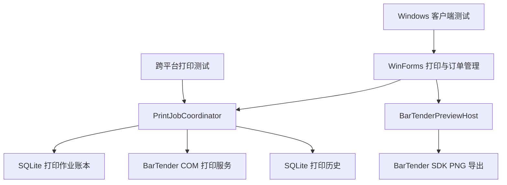

# 系统架构

## 组件结构

## 项目职责

| 项目 | 目标框架 | 职责 |
|---|---|---|
| `BarTenderPrinter` | net8.0-windows | WinForms、订单、模板、BarTender COM 打印、历史、补打印和本地账本 |
| `BarTenderPreviewHost` | net48 | 隔离 BarTender SDK 并导出标签预览 |
| `BarTenderPrinter.Printing.Tests` | net8.0 | 跨平台验证幂等、防重、崩溃恢复和补打印规则 |
| `BarTenderPrinter.Tests` | net8.0-windows | 验证客户端模型、校验、历史和打印工作流 |

## 打印可靠性

`PrintJobCoordinator` 为每次普通打印和补打印创建不可变快照。`SqlitePrintJobLedger` 先登记 `Received`，进入外部调用前转换为 `Submitting`，完成后保存 `Submitted`、`Failed` 或 `Uncertain`。

相同幂等键与相同请求返回已保存结果；相同幂等键与不同请求返回 `IDEMPOTENCY_CONFLICT`。进程启动时，遗留的 `Submitting` 自动转换为 `Uncertain`，避免无法确认的外部提交被再次执行。

补打印请求必须包含原作业 ID、审批 ID、原因和大于零的补打序号。历史记录保留这些字段用于审计和后续追溯。

## 存储边界

- `print_jobs.db` 保存打印作业请求摘要、状态和完成快照。
- `print_records.db` 保存打印历史和字段索引。
- `print_records.jsonl` 提供历史兼容副本。
- `history-records` 保存逐条不可变归档副本。
- `orders.json` 保存订单与模板配置。
- `application-state.json` 保存最近使用上下文。

## 外部边界

- `IBarTenderService` 隔离 BarTender COM 打印和预览调用。
- 主应用仅在 Windows x64 环境运行。
- 预览宿主采用独立进程隔离 SDK 生命周期、超时与崩溃。
- 真实打印验收依赖 BarTender 2022 R2、有效模板和现场打印机。
