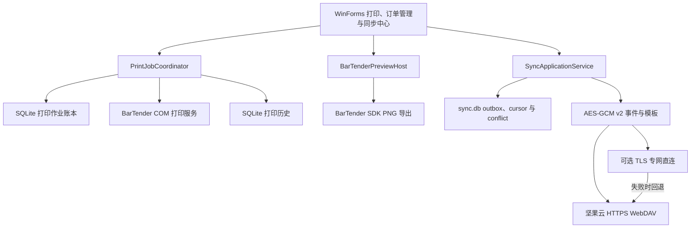

# 系统架构

## 组件结构



## 项目职责

| 项目 | 目标框架 | 职责 |
|---|---|---|
| `BarTenderPrinter` | net8.0-windows | WinForms、订单、模板、BarTender COM 打印、历史、补打印、本地账本和加密同步 |
| `BarTenderPreviewHost` | net48 | 隔离 BarTender SDK 并导出标签预览 |
| `BarTenderPrinter.Printing.Tests` | net8.0 | 跨平台验证幂等、防重、崩溃恢复和补打印规则 |
| `BarTenderPrinter.Tests` | net8.0-windows | 验证客户端模型、校验、历史、打印工作流、同步、WebDAV、直连和布局 |

## 打印可靠性

`PrintJobCoordinator` 为每次普通打印和补打印创建不可变快照。`SqlitePrintJobLedger` 先登记 `Received`，进入外部调用前转换为 `Submitting`，完成后保存 `Submitted`、`Failed` 或 `Uncertain`。

相同幂等键与相同请求返回已保存结果；相同幂等键与不同请求返回 `IDEMPOTENCY_CONFLICT`。进程启动时，遗留的 `Submitting` 自动转换为 `Uncertain`，避免无法确认的外部提交被再次执行。

补打印请求必须包含原作业 ID、审批 ID、原因和大于零的补打序号。历史记录保留这些字段用于审计和后续追溯。

`print_jobs.db` 是本机打印执行权威：只有作业执行设备使用它决定登记、幂等重放、提交、失败、`Uncertain` 和恢复。同步层逐条读取其中的状态快照并生成 `PrintJobEvent`；接收设备将事件追加到 `print_records.db` 的 `RemotePrintJobEvents` 共享事件表，用于查询和审计，不驱动本机重打、状态恢复或幂等判断。

## 加密同步

`SyncDataAdapter` 捕获 `orders.json`、`template_settings.json`、`print_records.db` 中每条 `RecordId` 历史，以及 `print_jobs.db` 中按 `JobId + State + UpdatedAtUtc` 标识的作业事件。订单与模板设置中的绝对路径会转换为 `btpsync-template:{sha256}`，接收端验证模板摘要后映射到本机 `template-cache`。

每台设备在 `sync.db` 中维护单调序号和 outbox。事件 ID 为 `{device-id}:{sequence}`；拉取端按设备 cursor 只处理连续缺失序号，使用 `AppliedEvents` 去重，并以实体基础版本识别订单和模板设置冲突。认证、schema 或摘要损坏会写入脱敏隔离记录并停止该设备当前序号之后的事件，其他设备继续同步；模板损坏保留最近已验证的本地缓存。打印历史与作业事件采用只追加合并，相同身份和不同内容会形成冲突。

加密对象格式为 v2：`BTPSOBJ1` magic、版本、nonce 长度、tag 长度、密文长度、12 字节随机 nonce、16 字节认证标签和密文。AES-256-GCM 的关联数据绑定格式版本、空间 ID、对象类型和对象 ID。`.btpsync` 使用 PBKDF2-HMAC-SHA256、16 字节 salt、600,000 次迭代和 AES-GCM；导入后使用 Windows DPAPI CurrentUser 保存为 `sync-profile.dat`。

## 通道与远端布局

应用仅接受固定 URL `https://dav.jianguoyun.com/dav/`。远端结构为：

```text
BarTenderPrinterSync/
  health-check.bin
  spaces/{space-id}/
    space.enc
    devices/{device-id}.enc
    events/{device-id}/{sequence}.evt
    templates/{sha256}.enc
    snapshots/{snapshot-id}.snap
    snapshot-pointer.enc
```

WebDAV 通过 `MKCOL`、`PROPFIND`、`HEAD`、`GET` 和条件 `PUT` 工作，不可变对象使用 `If-None-Match: *`。outbox 上传逐项处理，优先采用 `Retry-After`，其余临时错误使用带有界抖动的指数退避；认证失败与远端同名对象摘要不一致进入永久阻断状态。累计事件达到 500 条或累计密文字节达到 20MB 时生成加密快照，并通过 ETag/`If-Match` 更新 `snapshot-pointer.enc`；条件冲突会重读远端指针。导入成员的首次同步先恢复快照并仅拉取远端基线，持久化基线完成标志后，由共享数据保存路径开启本机真实变更捕获；空间创建者首次同步在 pull 后发布本机基线。冲突决议生成基础版本和新版本均高于冲突双方的新事件，携带决议来源并供其他设备直接收敛。

启用专网直连后，`LocalEndpointCollector` 只发布处于运行状态、具有默认路由且可用的单播地址。加密设备记录包含 host、端口、优先级、24 小时有效期和 TLS 证书 SHA-256 指纹。`DirectSyncClient` 仅尝试这些已发布端点，TLS 1.2/1.3 校验证书指纹，随后使用空间数据密钥完成会话认证并交换同一批密文对象；连接或端点失败后继续走 WebDAV。认证失败会结束本轮直连。

## 触发与界面

同步中心与打印页面、订单管理并列，集中显示工作空间、队列、设备、冲突、月度用量、活动和脱敏诊断。同步在应用启动、网络恢复、共享数据保存后 10 秒防抖以及退出前 5 秒限时刷新时自动触发，用户也可点击 `立即同步` 或取消当前操作。远端订单在本地编辑未保存时先落盘并延迟刷新界面，避免覆盖编辑状态。

## 存储边界

- `print_jobs.db` 保存打印作业请求摘要、状态和完成快照。
- `print_records.db` 保存打印历史和字段索引。
- `print_records.jsonl` 提供历史兼容副本。
- `history-records` 保存逐条不可变归档副本。
- `orders.json` 保存订单与模板配置。
- `application-state.json` 保存最近使用上下文。
- `sync-profile.dat` 保存 DPAPI CurrentUser 保护的连接配置。
- `sync.db` 保存 outbox、设备 cursor、冲突、已应用事件、实体版本、隔离对象、快照基线、设备、用量和活动。
- `template-cache` 保存摘要校验后的 `.btw` 模板。
- `sync-incoming`、`sync-staging` 是同步接收与暂存目录。
- `direct-sync-certificates` 保存 DPAPI 保护的本机 TLS 证书。

## 外部边界

- `IBarTenderService` 隔离 BarTender COM 打印和预览调用。
- 主应用仅在 Windows x64 环境运行。
- 预览宿主采用独立进程隔离 SDK 生命周期、超时与崩溃。
- 真实打印验收依赖 BarTender 2022 R2、有效模板和现场打印机。
- 坚果云只接收密文；WebDAV 凭据、数据密钥和直连私钥受当前 Windows 用户 DPAPI 保护。
- 错误恢复保留 outbox 和旧 cursor，支持取消、按对象退避、永久阻断可见性、损坏对象隔离和周期加密快照恢复。首版保留全部事件与快照。
