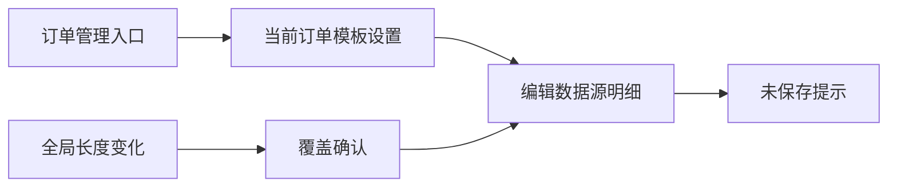

# 订单管理页长度与锁定交互优化

Feature Name: order-editor-layout-length-lock
Updated: 2026-08-12

## Description

订单管理页去掉左侧筛选区域，进入页面时显示当前打印订单模板设置。添加订单按钮位于内容区左上角。数据源明细使用锁定按钮替代锁定勾选框，长度设置通过单独长度标记区分全局同步和单项覆盖。

## Architecture

## Components and Interfaces

- `MainForm.BuildOrderEditor`：构建内容区添加按钮、订单信息、模板卡片和数据源明细。
- `MainForm.ApplyOrderGlobalLengthToGrid`：同步全局长度并处理单项覆盖确认。
- `MainForm.ConfirmOrderEditorChanges`：离开页面或关闭窗口前提示保存。
- `DataGridViewButtonColumn LockToggle`：切换订单数据源锁定状态。

## Data Models

- `DataSourceItem.LengthEdited`：标记数据源是否使用单独长度。
- `DataGridViewCell.Tag`：在编辑器中临时保存单独长度状态。

## Correctness Properties

- 全局长度只覆盖未设置单独长度的行，覆盖单项长度需确认。
- 单独长度在保存后通过 `LengthEdited` 保留。
- 锁定行保存时必须有锁定值。

## Error Handling

- 未保存修改离开页面时提供保存、放弃或取消操作。
- 缺少锁定值时阻止保存并提示字段名。

## Test Strategy

- 先设置单项长度再改全局长度，验证覆盖和跳过分支。
- 先设置全局长度再编辑单项长度，验证单项优先。
- 编辑订单后切换页面，验证未保存提示。
- 点击锁定按钮并留空锁定值，验证保存阻止。
