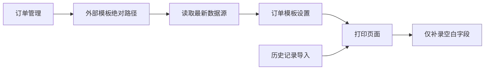

# 订单模板路径与状态同步

Feature Name: order-template-path-sync
Updated: 2026-08-12

## Description

订单模板统一保存外部绝对路径。模板读取、字段刷新、设置保存和打印均以该路径为唯一文件来源。订单编辑器增加解除模板关联操作，历史导入后的打印输入窗口只呈现空白字段。

## Architecture

## Components and Interfaces

- `OrderManager`：保存订单和外部模板快照，不复制模板文件。
- `MainForm` 订单编辑器：添加、删除、刷新模板及保存独立设置。
- `MainForm` 打印流程：合并当前输入值，收集空白可编辑字段后打印。
- `TemplateSettingsManager`：按模板绝对路径保存和读取设置。

## Data Models

- `OrderTemplate.SourcePath` 保存规范化外部绝对路径。
- `OrderTemplate.ArchivedPath` 仅用于旧数据反序列化识别，运行时不再作为有效模板来源。
- `OrderTemplate.Settings` 保存数据源值、锁定和打印配置。

## Correctness Properties

- 订单模板的读取路径、打印路径和设置键保持一致。
- 删除订单模板关联不会修改外部模板文件。
- 同名数据源刷新后保留原配置，新字段使用默认启用配置。
- 打印输入窗口只收集当前为空的可编辑数据源。

## Error Handling

- 路径无效时阻止应用订单并提示重新选择模板。
- 模板数据源读取失败时保留现有设置并显示操作提示。
- 订单保存失败时保留编辑器草稿。

## Test Strategy

- 历史记录部分字段导入后验证输入窗口字段集合。
- 添加、删除和保存多模板订单后重新加载验证关联。
- 修改外部模板字段后刷新并验证新旧字段合并。
- 保存锁定值后切换打印页验证输入值和只读状态。

## References

- `BarTenderPrinter/MainForm.cs`
- `BarTenderPrinter/OrderManager.cs`
- `BarTenderPrinter/TemplateSettingsManager.cs`
