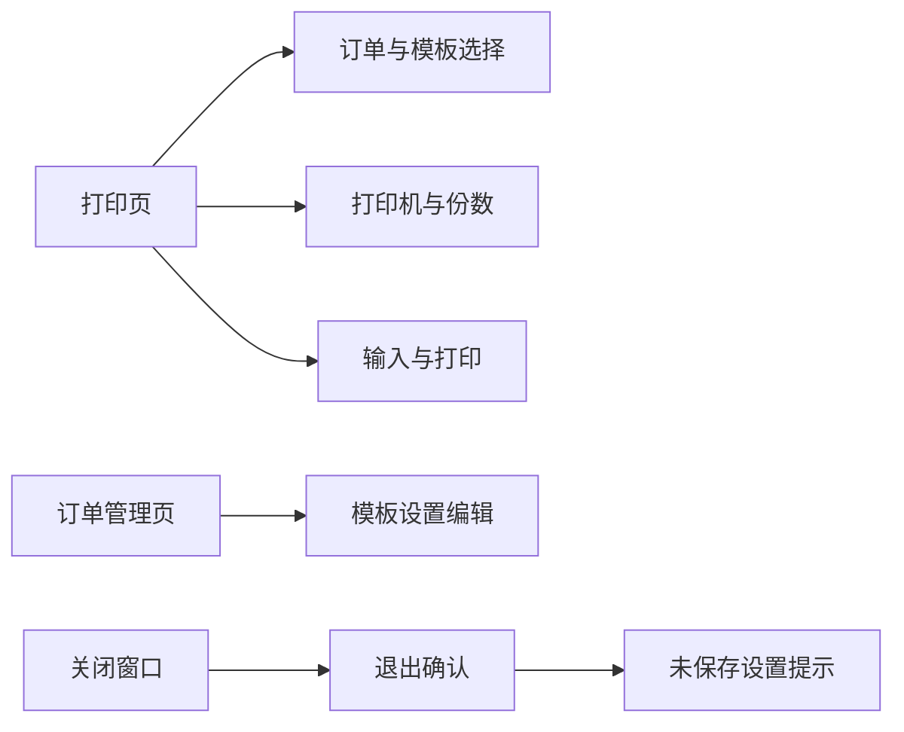

# 打印页布局与退出确认优化

Feature Name: print-order-layout-exit-confirm
Updated: 2026-08-12

## Description

打印页保留订单、模板、打印机、份数和打印输入流程。配置管理入口继续隐藏。订单管理页负责维护订单模板、校验、长度和锁定设置。关闭窗口时先确认退出，再处理未保存订单设置。

## Architecture

## Components and Interfaces

- `MainForm.InstallOrderSidebar`：初始化侧栏和隐藏配置入口。
- `MainForm.RebuildPrintPageLayout`：按可见控件重新排列打印页控件。
- `MainForm.FormClosing`：确认退出并处理未保存订单设置。
- `MainForm.BuildOrderEditor`：订单管理页内容区选择订单和编辑设置。

## Data Models

- `MainForm._orderEditorDirty`：订单管理页未保存状态。
- `PackagingOrder` 与 `OrderTemplate`：当前打印订单和模板。

## Correctness Properties

- 打印机和份数控件在打印页可见且可编辑。
- 配置入口在打印页隐藏。
- 退出取消时不释放资源。
- 订单管理页切换失败时恢复原订单选择。

## Error Handling

- 用户取消退出时取消 `FormClosing`。
- 保存订单设置失败时阻止关闭或页面切换。

## Test Strategy

- 打开打印页确认打印机和份数可见。
- 打开打印页确认配置入口隐藏。
- 修改订单设置后关闭窗口，验证退出确认与保存提示顺序。
- 选择无效订单模板时验证订单选择回滚。
