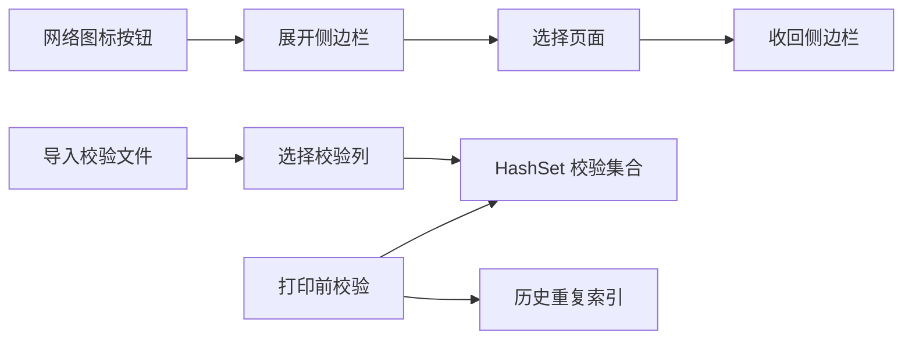

# 侧边栏与校验性能优化

Feature Name: sidebar-validation-performance
Updated: 2026-08-12

## Description

侧边栏使用网络图标按钮触发展开，展开后覆盖在主内容上方，选择页面后自动收回，主内容控件坐标保持稳定。校验功能拆分为本地数据完整匹配、长度校验和重复校验三个独立开关，本地校验数据导入后才允许启用本地匹配。

## Architecture

## Components and Interfaces

- `MainForm`：管理侧边栏展开状态、网络图标加载、页面切换和校验开关状态。
- `TemplateSettings`：持久化重复校验开关。
- `HistoryManager`：继续使用按模板索引的历史值集合提供 O(1) 重复查找。

## Data Models

- `_duplicateValidationEnabled`：当前模板是否启用重复校验。
- `TemplateSettings.DuplicateValidation`：模板级重复校验配置。
- `_localData`：本地校验数据哈希集合。

## Correctness Properties

- 侧边栏展开和收回不改变打印内容区域坐标。
- 本地数据完整匹配开关仅在 `_localData.Count > 0` 时可用。
- 本地数据校验失败直接阻止打印。
- 重复校验独立于本地数据完整匹配。

## Error Handling

- 网络图标加载失败时显示文本图标。
- Excel COM 不可用时提示保存为 CSV 后导入。
- 未选择校验列时取消导入并保持原校验状态。

## Test Strategy

- 点击图标展开侧边栏，选择两个页面后确认侧边栏收回。
- 未导入数据时确认本地数据完整匹配开关禁用。
- 导入 Excel/CSV 多列文件时确认出现列选择弹窗。
- 同时启用本地匹配、长度校验和重复校验后验证打印前阻止规则。

## References

- `BarTenderPrinter/MainForm.cs`
- `BarTenderPrinter/MainForm.Designer.cs`
- `BarTenderPrinter/TemplateSettingsManager.cs`
