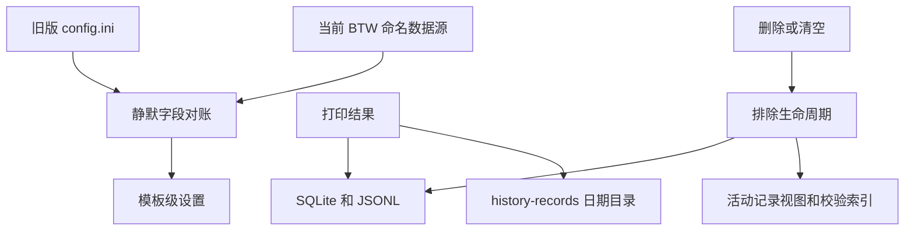

# 兼容升级与历史保留设计

Feature Name: compatible-history-retention
Updated: 2026-08-13

## Description

模板自动加载改为静默字段发现和按名合并，交互式数据源窗口仅保留给显式编辑入口。历史记录增加排除生命周期；排除状态控制业务可见性和校验参与度，原始记录继续保存在主存储和独立文件副本中。

## Architecture

## Components and Interfaces

- `MainForm.LoadTemplateDataSources`：异步读取字段、淘汰旧请求、静默合并并保存。
- `MainForm.btnEditDataSources_Click`：唯一的交互式普通模板数据源编辑入口。
- `PrintRecord`：增加排除时间、操作者、原因和批次字段。
- `HistoryManager`：所有查询和索引使用活动记录；删除和清空更新排除状态。
- `HistoryManager.WriteRecordArchive`：按日期和 `RecordId` 写入不可覆盖的独立 JSON 文件。
- `AppPaths.HistoryRecordsDirectory`：指向 `AppContext.BaseDirectory/history-records`。

## Data Models

`PrintRecord` 新增：

- `IsExcluded`
- `ExcludedAtUtc`
- `ExcludedBy`
- `ExclusionReason`
- `ExclusionBatchId`

独立副本路径：

`history-records/yyyy/MM/dd/yyyyMMdd_HHmmss_RecordId.json`

## Correctness Properties

- 排除操作不减少主存储记录总量。
- 排除记录不参与搜索、统计、最新成功记录、重复索引和按 ID 业务调用。
- 同一清空操作内的所有记录共享批次 ID。
- 自动模板加载不显示 `DataSourceSelectDialog`。
- 旧配置只由首次缺少模板级设置的模板承接。
- 独立历史副本使用创建后不覆盖策略。

## Error Handling

- 模板字段读取失败时保留当前状态并记录错误。
- 过期异步字段请求直接丢弃。
- 排除持久化失败时回滚内存排除状态和索引。
- 独立副本写入失败时记录路径及错误，并回滚新增历史。
- 损坏历史继续使用既有 checksum 和坏行隔离流程。

## Test Strategy

- 验证自动字段合并保留同名设置并启用新增字段。
- 验证排除记录退出搜索、统计、最新记录和重复校验。
- 验证清空批次统一且主存储记录数量保持不变。
- 验证独立副本按日期和记录 ID 创建且不覆盖。
- 验证旧记录 checksum 兼容及排除后新版 checksum。
- 在 Windows runner 执行完整 xUnit、自包含发布和安装包构建。
