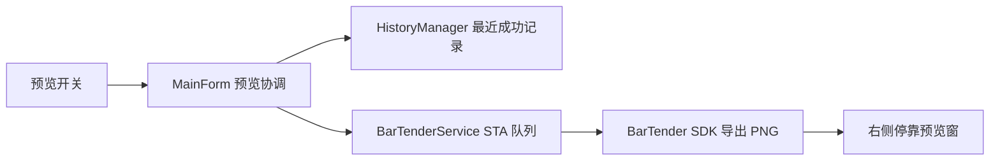

# 右侧停靠打印预览

Feature Name: docked-print-preview
Updated: 2026-08-13

## Description

主界面标题栏增加预览开关。预览窗以无边框 owned form 形式停靠在主界面右侧。预览图片由 BarTender COM SDK 导出，优先使用当前模板最近成功打印记录的字段值，缺少成功记录时使用空字段生成原模板预览。

## Architecture

## Components and Interfaces

- `MainForm`：管理预览开关、模板切换、打印成功刷新和停靠位置。
- `PreviewForm`：展示图片、来源说明、加载和错误状态。
- `IBarTenderService.ExportPreviewAsync`：在专用 STA 队列中导出模板图片。
- `IHistoryRepository.GetLatestSuccessful`：按当前模板返回最近的 `PASS` 或 `REPRINT_PASS` 记录。

## Data Models

- 预览输入：模板路径和字段值快照。
- 预览输出：PNG 文件路径。
- 预览来源：最近成功打印或原模板。

## Correctness Properties

- 预览记录必须匹配当前模板。
- 成功记录选择顺序必须为历史存储顺序的倒序。
- BarTender SDK 调用必须在同一 STA 队列串行执行。
- 图片加载必须释放文件句柄。

## Error Handling

- 模板文件缺失时在预览窗显示模板不可用。
- SDK 导出失败时在预览窗显示错误并记录日志。
- 快速切换模板时使用请求版本号忽略过期结果。

## Test Strategy

- 单元测试覆盖最近成功记录选择和失败记录过滤。
- GitHub Actions 执行 WinForms 编译与现有回归测试。
- Windows 实机验证停靠、模板切换、首次预览和成功打印刷新。
