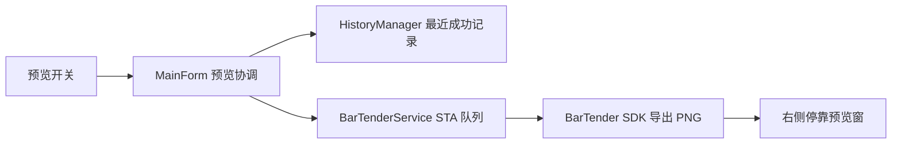

# 右侧停靠打印预览

Feature Name: docked-print-preview
Updated: 2026-08-13

## Description

主界面标题栏提供预览开关。预览窗以无边框 owned form 形式停靠在主界面右侧。预览图片由目标 BarTender 2022 R2 安装附带的 `Seagull.BarTender.Print` SDK 导出，优先使用当前模板最近成功打印记录的字段值，缺少成功记录时使用空字段生成原模板预览。SDK 检测失败时界面保持禁用状态；实机验证完成前按候选功能管理。

## Architecture

## Components and Interfaces

- `MainForm`：管理预览开关、模板切换、打印成功刷新和停靠位置。
- `PreviewForm`：展示图片、来源说明、加载和错误状态。
- `IBarTenderService.ExportPreviewAsync`：通过受控反射适配 BarTender 2022 R2 SDK，设置命名数据源并导出 PNG。
- `IHistoryRepository.GetLatestSuccessful`：按当前模板返回最近的 `PASS` 或 `REPRINT_PASS` 记录。

原模板预览使用 `LabelFormatThumbnail.Create(templatePath, Color.White, 1200, 1200)`。包含成功记录字段快照时，打开 `LabelFormatDocument`、调用 `SubStrings.SetSubString` 并通过 `ExportImageToFile` 导出 300 DPI PNG。

## Data Models

- 预览输入：模板路径和字段值快照。
- 预览输出：PNG 文件路径。
- 预览来源：最近成功打印或原模板。

## Correctness Properties

- 预览记录必须匹配当前模板。
- 成功记录选择顺序必须为历史存储顺序的倒序。
- BarTender SDK 调用与 COM 打印共用应用专用 STA 队列和操作锁，确保进程内串行执行。
- 图片加载必须释放文件句柄。

## Error Handling

- 模板文件缺失时在预览窗显示模板不可用。
- SDK 导出失败时在预览窗显示错误并记录日志。
- SDK 自动发现先读取程序集与 PE 元数据，优先加载 `SDK/Redist/x64` 中最新的 BarTender 2022 R2 `11.3.x` 程序集。
- 任一命名数据源赋值失败时终止动态预览，避免展示字段缺失的标签图。
- SDK Engine 仅在成功启动后进入共享状态，启动失败时立即清理临时实例。
- 预览缓存键包含模板绝对路径、模板修改时间和排序后的字段快照；缓存 PNG 仍需通过图片解码校验。
- 快速切换模板时使用请求版本号忽略过期结果。
- 打印队列存在待处理作业时延后预览，队列清空后再执行静默导出。
- 预览必须通过目标 BarTender 版本附带的 `Seagull.BarTender.Print` SDK 实现并完成实机验证。

## Test Strategy

- 单元测试覆盖最近成功记录选择和失败记录过滤。
- 单元测试覆盖缓存键的字段顺序稳定性、模板与字段失效条件、SDK Redist 路径识别和 PE x64 检测。
- GitHub Actions 执行 WinForms 编译与现有回归测试。
- Windows 实机验证停靠、模板切换、首次预览和成功打印刷新。

## References

- Seagull Support: https://support.seagullsoftware.com/hc/en-us/articles/360000056227-How-to-automate-exporting-Image-Previews-of-BarTender-documents-via-NET-SDK
- Seagull Support: https://support.seagullsoftware.com/hc/en-us/articles/360023921313-How-does-the-BarTender-net-SDK-iterate-through-substrings-named-data-sources
- BarcodeX community example: https://barcodex.cn/guide/18.html
