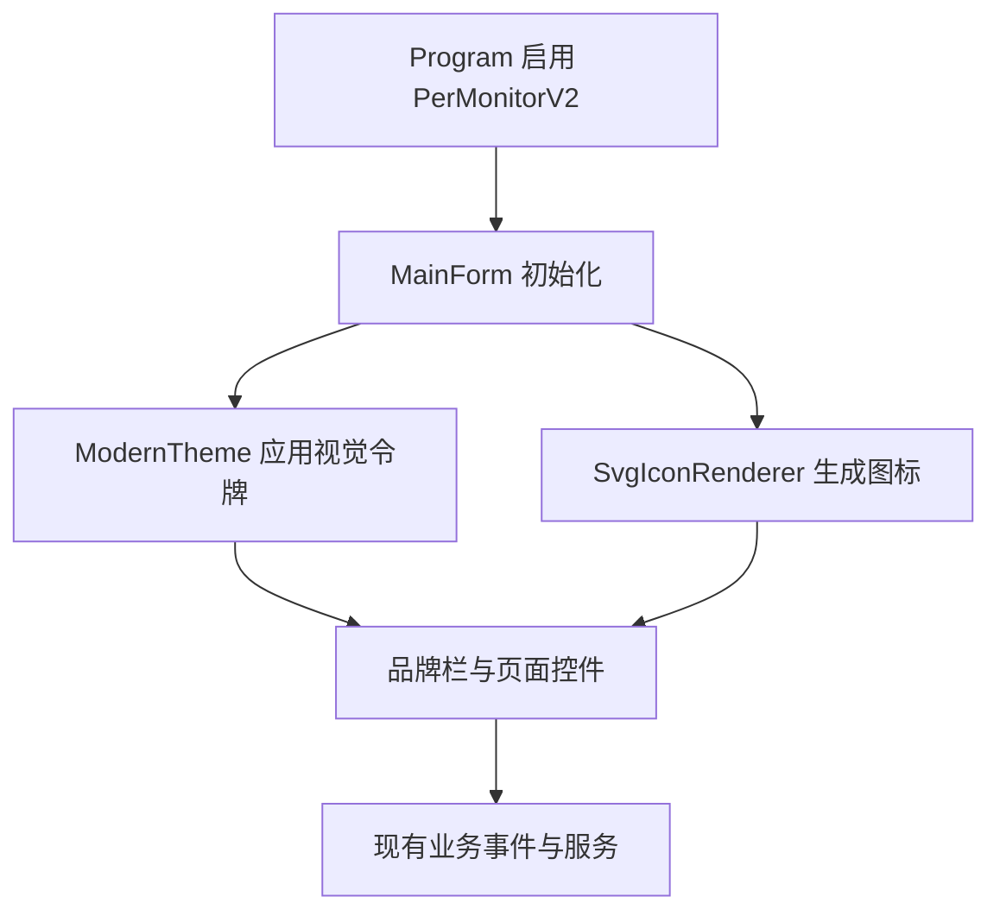

# Modern Professional UI

Feature Name: modern-professional-ui
Updated: 2026-08-13

## Description

本设计以 Fluent 桌面应用的品牌栏、左侧导航、浮层卡片、统一命令视觉和非模态状态表达为参考，在现有 WinForms 控件树上进行渐进式升级。升级范围覆盖主题、品牌栏、图标、导航、表格、状态栏、日志折叠、关于窗口、预览窗口和运行时对话框，同时保持现有页面结构和业务事件。

## Architecture

## Components and Interfaces

### `MiuiTheme`

- 提供品牌色、背景色、字体层级和间距令牌。
- 为 Button、ComboBox、NumericUpDown、CheckBox、TabControl、DataGridView、StatusStrip 提供统一样式。
- 提供递归主题入口，覆盖运行时创建的控件。

### `SvgIconRenderer`

- 使用预定义 SVG path 语义对应的 GDI+ 路径绘制线性图标。
- 支持导出、预览、菜单、打印、订单、刷新、搜索、清空、导入、补打印、信息和日志图标。
- 根据目标尺寸生成透明位图，按钮文字继续承担可访问名称。

### `MainForm` 品牌栏

- 使用现有 `icon.ico` 作为窗口和品牌图标来源。
- 顶部显示产品名、版本徽标和 `By---池鱼`。
- 右侧提供预览开关、日志折叠、关于和导出日志操作。

### 运行时窗口

- 关于、登录、手动数据源、校验列、全局长度、历史导入和补打印窗口使用统一主题入口。
- `DataSourceSelectDialog`、`DataSourceInputDialog` 和 `PreviewForm` 独立设置 DPI 缩放基线。
- 预览窗口停靠尺寸、边距和宽度范围按主窗口当前 DPI 计算。

### 页面视觉

- 左侧导航采用深色品牌背景和高亮活动项。
- 打印主操作采用品牌渐变感主色的高对比按钮。
- 历史表格采用浅色表头、舒适行高和柔和选中背景。
- 状态栏拆分为状态、作者和版本信息。
- 日志折叠后，打印、订单、导航和历史区域使用释放出的垂直空间。

## Data Models

本功能不增加持久化业务数据。图标名称使用内部枚举表达，主题令牌使用静态只读颜色和字体工厂。

## Correctness Properties

1. 主题应用不得替换控件实例或解除事件处理器。
2. 图标位图尺寸必须与目标 DPI 成比例。
3. 主窗口 `Icon` 与可执行文件应用图标一致。
4. 作者文字必须精确显示为 `By---池鱼`。
5. 活动导航按钮必须具有唯一高亮状态。
6. 日志折叠和展开后，底部页签必须位于日志区或状态栏上方。
7. 动态位图、圆角区域和运行时对话框必须具有确定的释放路径。

## Error Handling

- 应用图标加载异常时记录日志并保留文字品牌。
- 图标绘制异常时按钮继续显示文字。
- DPI 变化时重新应用布局和图标，异常由现有 UI 日志记录。

## Test Strategy

- 单元测试验证主题颜色对比、作者文案，以及全部图标在 16、24、32 像素下的生成结果。
- Windows 目标编译验证 Designer 和 GDI+ API。
- Windows runner 执行现有 xUnit 回归测试。
- Windows 实机检查 100%、125%、150%、200% DPI 下品牌栏、导航、动态输入、历史表格、日志折叠、运行时对话框和预览停靠。

## References

[^1]: (Microsoft Learn) - Structure a modern WinUI 3 desktop app: https://learn.microsoft.com/en-us/windows/apps/develop/ui/windows-app-sdk-app-structure
[^2]: (Microsoft Learn) - Modern Fluent design command bars and grids: https://learn.microsoft.com/zh-cn/power-apps/user/modern-fluent-design
