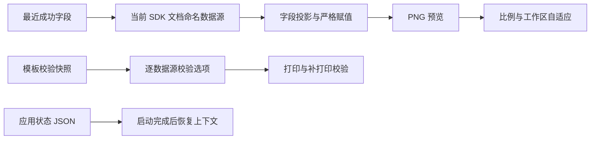

# 预览、校验与会话恢复综合优化

Feature Name: preview-validation-session-optimization
Updated: 2026-08-13

## Description

动态预览从当前 SDK 文档读取真实命名数据源，并在赋值前过滤历史快照中的旧字段。预览窗口根据图片比例和屏幕工作区调整尺寸。模板继续共享一份本地校验数据快照，逐数据源保存是否参与校验。独立应用状态文件保存最近工作上下文，并在异步资源初始化完成后统一恢复。

## Architecture

## Components and Interfaces

- `BarTenderService.ExportDocumentPreview`：打开文档后枚举 `SubStrings`，过滤未知历史字段，再严格调用 `SetSubString`。
- `PreviewForm`：保持 `Zoom`，提供当前图片纵横比并使用带内边距的内容容器。
- `MainForm.DockPreviewForm`：根据图片比例、主窗口位置和屏幕工作区计算完整可见的预览边界。
- `DataSourceItem.UseLocalDataValidation`：保存该字段是否使用模板关联的校验快照。
- `ValidationService.FindLocalDataMismatches`：按逐字段选择集合执行完整匹配。
- `ApplicationStateManager`：原子保存和容错加载最近订单、模板、打印机、份数与预览状态。

## Data Models

- `DataSourceItem.UseLocalDataValidation`：逐数据源本地校验开关。
- `ApplicationState.ActiveOrderId`：最近订单 ID。
- `ApplicationState.ActiveTemplateId`：最近订单模板 ID。
- `ApplicationState.SelectedTemplatePath`：最近普通模板绝对路径。
- `ApplicationState.Printer`、`Copies`、`PreviewEnabled`：最近打印和预览状态。
- 旧版 `LocalDataTargetField` 保留为反序列化迁移输入，新配置以逐数据源开关为权威状态。

## Correctness Properties

- SDK 层只忽略当前文档中不存在的历史字段。
- 当前文档中存在的字段赋值失败时不生成动态预览。
- 动态字段交集为空时使用原模板缩略图。
- 本地校验只检查已启用且勾选逐数据源校验的字段。
- 关闭模板级本地校验时保留逐数据源勾选和快照。
- 应用状态在业务配置、订单和打印机加载完成后恢复。
- 右键打开模板参数优先于最近使用状态。

## Error Handling

- SDK 命名数据源枚举失败时记录具体错误并停止动态预览。
- 未知历史字段写入警告日志并继续生成预览。
- 校验快照缺失时关闭模板级本地校验并保留字段选择。
- 应用状态文件损坏时记录错误并返回默认状态。
- 预览边界始终限制在当前屏幕工作区内。

## Test Strategy

- 单元测试覆盖历史字段与当前命名数据源的大小写无关投影和空交集。
- 单元测试覆盖逐数据源校验、旧单字段迁移和默认全选。
- 单元测试覆盖应用状态保存、加载和损坏文件回退。
- Windows Actions 执行完整 xUnit、WinForms 编译和 self-contained publish。
- BarTender 2022 R2 实机验证打印后动态预览、未知旧字段过滤、静默性和零额外打印作业。
- 多比例图片和多屏 DPI 环境验证预览窗口完整可见。

## References

- Seagull Support: https://support.seagullsoftware.com/hc/en-us/articles/360000056227-How-to-automate-exporting-Image-Previews-of-BarTender-documents-via-NET-SDK
- Seagull Support: https://support.seagullsoftware.com/hc/en-us/articles/360023921313-How-does-the-BarTender-net-SDK-iterate-through-substrings-named-data-sources
- Seagull Support: https://support.seagullsoftware.com/hc/en-us/articles/360000493828-Assign-values-to-objects-on-the-label-via-NET-SDK
- Baseline: `../2026-08-13-docked-print-preview/`
- Baseline: `../2026-08-12-sidebar-validation-performance/`
- Baseline: `../2026-08-12-order-template-validation-data-persistence/`
- Baseline: `../2026-08-12-order-template-path-sync/`
- Baseline: `../2026-08-12-order-editor-layout-length-lock/`
- Baseline: `../2026-08-12-print-order-layout-exit-confirm/`
