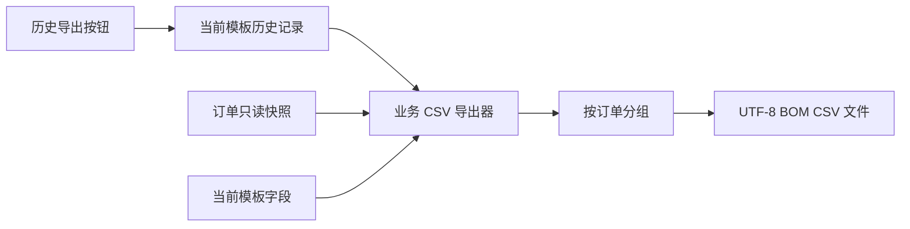

# 打印历史业务 CSV 导出设计

Feature Name: business-history-csv-export
Updated: 2026-08-14

## Description

新增独立的业务 CSV 转换组件，将当前模板筛选后的打印历史按订单拆分并展开为业务列。界面只负责收集当前模板字段、订单快照和目标目录；转换组件负责映射、格式化、转义及写出。

## Architecture

`BusinessHistoryCsvExporter` 不持有 `HistoryManager` 或 `OrderManager`，调用方传入只读集合，避免导出路径触发内部历史保存。

## Components and Interfaces

### BusinessHistoryCsvExporter

- 输入：目标目录、打印记录集合、订单集合、当前模板字段集合、导出日期。
- 输出：已生成文件路径集合。
- 职责：订单关联、字段并集约束、时间格式化、文件名清理、CSV 转义和 UTF-8 BOM 写出。

### MainForm 导出入口

- 读取 `GetCurrentHistoryRecords()`。
- 从当前已加载模板的 `_dataSources` 获取数据源原名和模板顺序。
- 使用文件夹选择器确定目标目录。
- 导出当前筛选条件下的全部历史记录，不受历史表格分页限制。
- 调用导出器并向用户显示生成文件数量。

## Data Models

每行列顺序：

1. 日期
2. 客户
3. 颜色
4. 机型
5. 订单号
6. 当前模板字段，每个字段单独一列
7. 操作人
8. 打印时间
9. 打印状态

订单通过 `PrintRecord.OrderId` 与 `PackagingOrder.OrderId` 关联。数据源通过 `PrintRecord.FieldValues` 的不区分大小写键映射。

## Correctness Properties

- 每条输入记录最多写入一个订单文件。
- 输出数据源列集合严格等于去重后的当前模板字段集合。
- 每行列数等于固定列数加当前模板字段数。
- 缺失映射产生空字段。
- 写出过程不调用历史仓库新增、更新、排除或保存方法。
- 所有数据源值经过 `CsvUtils.Escape` 双引号转义。

## Error Handling

- 无可导出记录时由界面提示并结束。
- 目标目录不可写或文件写入失败时抛出异常，由界面显示错误消息。
- 无法解析的打印时间输出空日期和空打印时间。
- 文件名非法字符转换为下划线，空业务字段保留为空片段。
- 同名目标文件需要界面获得覆盖确认；不同订单映射到同一文件名时终止导出并提示冲突。

## Test Strategy

- 验证固定表头和当前模板字段顺序。
- 验证订单字段、时间格式、操作人和状态映射。
- 验证缺失数据源值输出空单元格。
- 验证多订单拆分及文件名。
- 验证中文 UTF-8 BOM、逗号、换行和双引号往返解析。
- 验证导出前后输入记录和订单对象保持不变。

## References

- `BarTenderPrinter/HistoryManager.cs`：打印历史模型与内部持久化。
- `BarTenderPrinter/OrderManager.cs`：订单业务模型。
- `BarTenderPrinter/CsvUtils.cs`：CSV 双引号转义与解析。
- `BarTenderPrinter/MainForm.cs`：历史导出入口和当前模板上下文。
