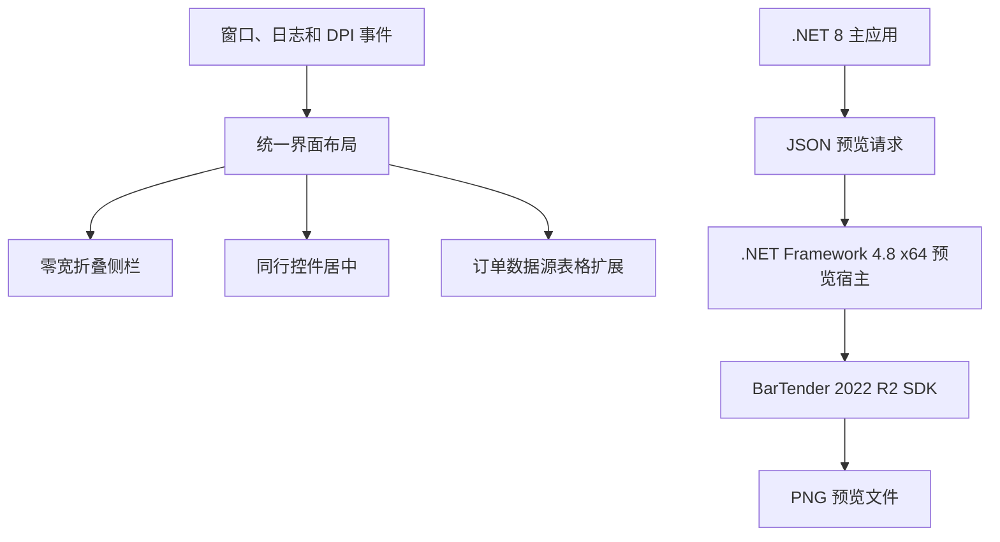

# 布局与预览运行时兼容修复设计

Feature Name: layout-preview-runtime-compatibility
Updated: 2026-08-14

## Description

本设计收敛主窗体布局入口，并用进程边界隔离 .NET 8 主应用与面向 .NET Framework 4.7 编译的 BarTender 2022 R2 SDK。SDK 内部调用 `Mutex(Boolean, String, Boolean&, MutexSecurity)`，该实例构造器在 .NET 8 CoreCLR 中不存在，独立 .NET Framework 预览宿主提供 SDK 所需的 CLR 4 API。

## Architecture

## Components and Interfaces

### MainForm 布局

- 折叠侧栏宽度为零，折叠时隐藏导航面板。
- `LayoutOrderEditor` 负责订单四列筛选项和数据源表格尺寸。
- 主窗体尺寸、日志显示状态、DPI 和订单内容区尺寸变化均触发布局。
- 同行控件使用统一垂直中心计算。

### BarTenderService

- 只检测 SDK 路径与预览宿主可用性，不在 .NET 8 默认 `AssemblyLoadContext` 加载 Seagull SDK。
- 每次请求创建临时 JSON 文件并启动短生命周期预览宿主。
- 预览宿主超时、失败或未生成有效图片时返回可诊断错误。

### BarTenderPreviewHost

- 目标框架为 `net48`，平台为 x64。
- 使用反射加载目标机器的 `Seagull.BarTender.Print.dll` 及同目录依赖。
- 动态字段存在时启动 Engine 并调用 `ExportImageToFile`。
- 动态字段为空时调用 `LabelFormatThumbnail.Create`。
- 完成后关闭文档和 Engine，并通过退出码报告结果。

## Data Models

预览请求 JSON 包含 SDK 路径、模板路径、输出路径和字段字典。错误详情写入独立响应文本文件，避免依赖控制台编码解析。

## Correctness Properties

- 折叠状态侧栏宽度等于零。
- 日志折叠后订单数据源表格底边接近订单内容区底边。
- 订单滚动最小高度等于实际最后一个内容控件底边加底部间距。
- .NET 8 主进程不加载 `Seagull.BarTender.Print.dll`。
- 预览输出位于应用预览目录且通过图片有效性检查。
- 预览失败不改变打印 COM 连接和打印队列状态。

## Error Handling

- 缺少预览宿主时在顶栏禁用预览并显示原因。
- SDK 路径、模板路径或输出路径无效时预览宿主返回非零退出码。
- 预览宿主在超时后由主应用终止。
- SDK 反射异常保留最底层异常类型和消息。

## Test Strategy

- 编译 net48 x64 预览宿主和 net8.0-windows 主应用。
- 测试预览请求序列化、宿主路径检测和 SDK 路径筛选。
- 在 Windows 100%、125%、150%、200% DPI 验证侧栏、同行控件和日志折叠。
- 在安装 BarTender 2022 R2 的 Windows x64 机器验证原模板和动态字段预览。
- 验证预览失败、超时和关闭应用时打印功能保持可用。

## References

- `BarTenderPrinter/MainForm.cs`：主窗体和订单编辑器布局。
- `BarTenderPrinter/BarTenderService.cs`：预览宿主调用与打印 COM 服务。
- `BarTenderPreviewHost/Program.cs`：BarTender SDK 隔离宿主。
- Microsoft .NET API：`System.Threading.Mutex` 运行时 API 差异。
- Seagull BarTender 2022 R2 SDK：`Seagull.BarTender.Print` Engine 和文档图片导出接口。
