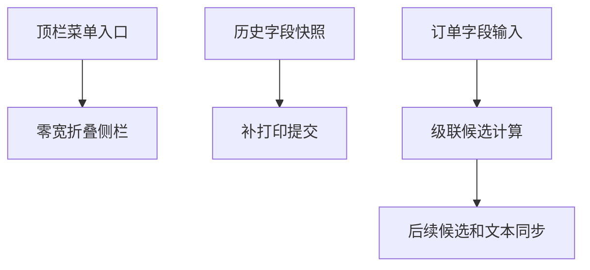

# 打印与订单交互回归修复设计

Feature Name: print-order-interaction-regression
Updated: 2026-08-14

## Description

本设计统一顶栏菜单入口和按钮内容布局，明确补打印使用历史快照的业务边界，并将订单级联候选计算收敛为可测试的纯逻辑。

## Architecture

## Components and Interfaces

- `MainForm` 将菜单按钮直接放入顶栏，按字体和 DPI 计算按钮内容尺寸，并使补打印直接提交历史字段快照。
- `OrderCascadeService` 根据客户、机型和颜色筛选、去重并排序后续候选。
- 订单编辑器仅保留仍属于新候选集合的后续文本。

## Data Models

沿用 `PackagingOrder` 与 `PrintRecord`，持久化格式保持不变。

## Correctness Properties

- 侧栏折叠时宽度等于零且面板隐藏。
- 补打印调用链跳过普通打印字段和业务校验。
- 每一级候选满足全部已填写前置字段。
- 下游当前文本仅在仍属于新候选集合时保留。
- 按钮内容在多 DPI 环境完整显示。

## Error Handling

- 历史模板缺失或打印机不可用时显示明确错误。
- 模板版本变化时要求审批人员再次确认。
- 空订单集合返回空候选集合并允许继续输入新值。

## Test Strategy

- 单元测试订单候选过滤、大小写匹配、自然去重和新值空候选。
- 编译 WinForms 主应用与测试项目。
- 在 Windows 多 DPI 环境验证顶栏、历史按钮、订单校验行和打印按钮。

## References

- `BarTenderPrinter/MainForm.cs`
- `BarTenderPrinter/OrderManager.cs`
- `BarTenderPrinter.Tests/ModelAndValidationTests.cs`
