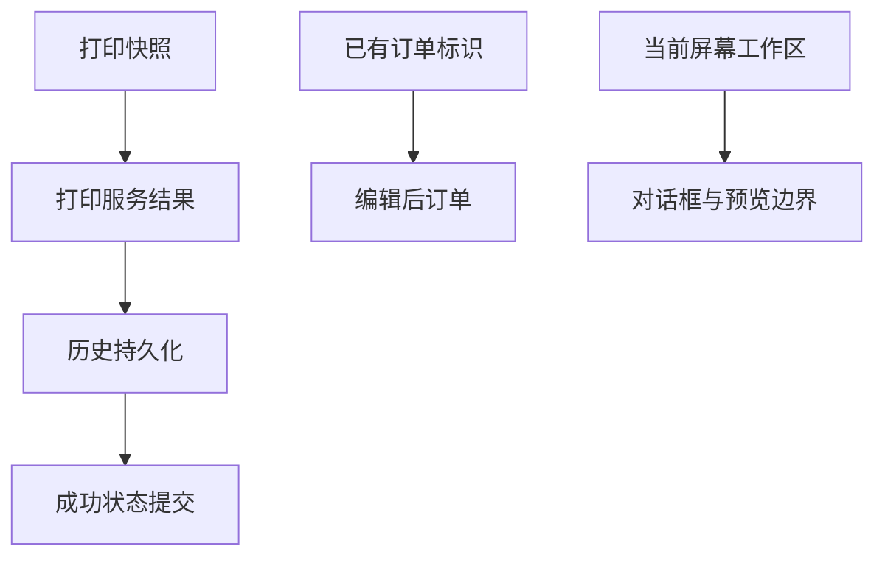

# 生产一致性与运行安全修复设计

Feature Name: production-consistency-hardening
Updated: 2026-08-14

## Description

本设计将打印作业视为带快照的单一事务，在打印结果确定后持久化历史并提交界面状态；订单编辑继承稳定标识；账户加载显式区分首次创建与文件损坏；布局计算遵守当前屏幕工作区。

## Architecture

## Components and Interfaces

- `MainForm` 在单个普通打印作业期间阻止重复提交和窗口退出，并以入队快照推进成功状态。
- `AccountManager` 公开加载错误，账户文件解析失败时保持文件原样。
- `DataSourceSelectDialog` 使用可调整窗口和双向滚动根容器。
- 预览平铺算法先计算主窗口最小尺寸，再选择水平或垂直布局。

## Data Models

- `PackagingOrder.Id` 保持现有字符串格式和持久化格式。
- `PrintRecord` 和账户 JSON 保持现有结构。

## Correctness Properties

- 每个已完成普通打印作业产生一条结果历史。
- 失败作业不推进锁定值或自动序号。
- 编辑订单前后的 `OrderId` 相等。
- 损坏账户文件的字节内容在加载后保持不变。
- 主窗口和预览窗口边界均位于当前工作区内。

## Error Handling

- 打印队列活动时取消关闭并显示等待原因。
- 历史保存失败时记录明确错误并保留打印结果诊断。
- 账户加载失败时记录错误并保持最低权限会话。
- 工作区空间不足时保持主窗口完整，并将预览覆盖停靠在工作区右侧。

## Test Strategy

- 单元测试订单替换后的标识稳定性和账户文件损坏保全。
- 编译测试项目与 WinForms 应用。
- Windows 实机验证打印成功、打印失败、关闭协调及 100% 到 200% DPI。

## References

- `BarTenderPrinter/MainForm.cs`
- `BarTenderPrinter/AccountManager.cs`
- `BarTenderPrinter/OrderManager.cs`
- `BarTenderPrinter.Tests/ModelAndValidationTests.cs`
