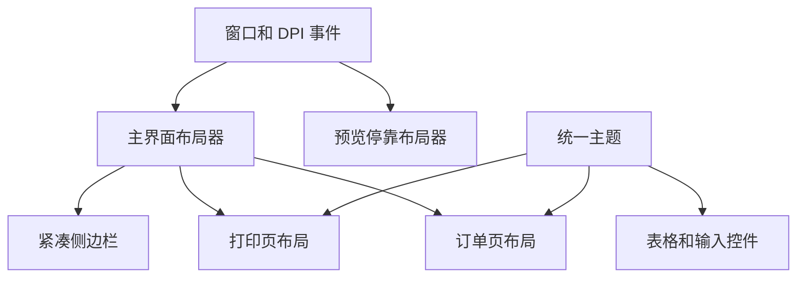

# 界面布局、可见性与预览优化设计

Feature Name: ui-layout-visibility-preview
Updated: 2026-08-14

## Description

本设计通过统一主题尺寸、动态布局入口和预览平铺算法修复 11 类界面问题。业务控件实例和事件处理器保持不变，改动集中在视觉样式与几何计算。

## Architecture

## Components and Interfaces

### MiuiTheme

- 按控件 DPI 设置按钮内边距、表格行高和表头高度。
- 使用完整矩形边界保留按钮原生边缘。
- ComboBox 使用可见边框样式。
- DataGridView 使用浅色选中背景、深色文字和清晰网格线。

### MainForm 布局

- 侧边栏展开按钮加入顶栏命令区。
- 收起侧栏仅保留紧凑导航轨道。
- `LayoutModernShell` 统一调用侧栏、历史工具栏、统计卡片和订单页面布局。
- 日志切换后重新计算订单页高度和内部内容布局。

### 订单数据源表格

- 主题应用后覆盖订单表格专属网格设置。
- 使用 `Single` 单元格边框和可见表头边框。
- 列宽与行高使用 DPI 尺寸。

### PreviewForm 与 DockPreviewForm

- 显示前设置 owner 和边界。
- 预览优先使用主窗体右侧或左侧空余区域。
- 空余区域不足时，将主窗体与预览窗在当前工作区水平平铺。
- 最小化、DPI 和显示拓扑变化具有独立处理入口。

## Correctness Properties

- 预览边界和主窗体操作区不相交。
- 所有表格选中前景与背景保持可读对比。
- 日志隐藏时订单页底边等于状态栏顶边。
- 动态控件尺寸使用当前 `DeviceDpi`。
- 主题调用不会移除订单数据源表格的专属边框。

## Error Handling

- 工作区极窄时，预览宽度受工作区和逻辑最小值共同约束。
- 窗口销毁或最小化期间跳过异步预览停靠。
- 显示配置变化时通过消息回调延迟重新布局。

## Test Strategy

- 检查按钮、ComboBox、DataGridView 主题属性。
- 检查日志显示与隐藏时订单页面边界。
- 检查 100%、125%、150%、200% DPI 下文字和控件边缘。
- 检查主窗体移动、缩放、最大化、最小化及跨显示器时预览不遮挡。
- 检查历史记录选中状态和订单数据源列分隔线。

## References

- `BarTenderPrinter/MainForm.cs`：主布局、订单页、历史页和预览停靠。
- `BarTenderPrinter/MainForm.Designer.cs`：基础 WinForms 控件尺寸。
- `BarTenderPrinter/MiuiTheme.cs`：统一主题和 DataGridView 样式。
- `BarTenderPrinter/PreviewForm.cs`：预览窗口结构。
