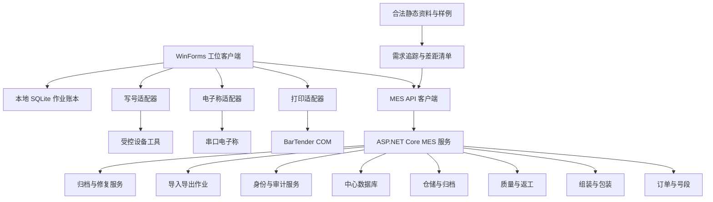
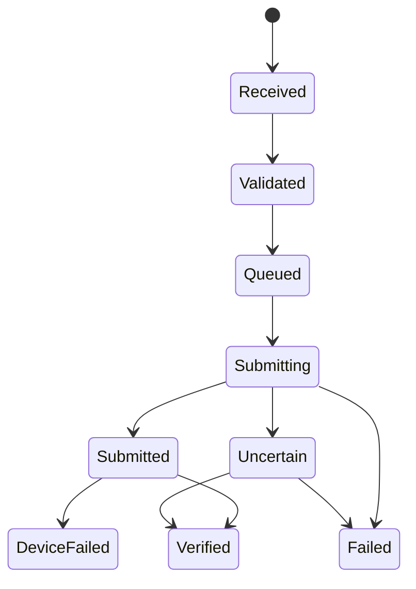

# MES 核心能力集成设计

Feature Name: mes-core-integration
Updated: 2026-08-15

## 1. 描述

本设计在现有 BarTenderPrinter 上构建完整 WinForms MES 客户端、中心 MES 服务、共享领域模型、持久化和设备适配边界。WinForms 客户端承载全部业务操作面、现场扫码、模板预览、设备执行和本地恢复；中心服务承担主数据、全局一致性、跨工位流程、自动作业、安全控制和企业追溯。

完整能力复刻采用净室式重实现边界：业务输入来自合法静态手册、操作说明、字段与界面样例、数据样例和获准协议；实现输入采用自主源代码、标准库和已批准依赖。HASP、Sentinel、商业加密授权、未知二进制、证书、密钥、生产数据库和生产日志均由制品门禁阻断。认证、授权、密码散列、审计链、输入验证、脱敏和幂等机制作为目标系统安全基线保留并强化。

## 2. 架构



### 2.1 项目结构

```text
BarTenderPrinter/             现有 WinForms 工位客户端
BarTenderPrinter.Domain/      领域模型、状态机、规则和契约
BarTenderPrinter.MesApi/      ASP.NET Core 中心服务
BarTenderPrinter.Persistence/ 中心数据库仓储和迁移
BarTenderPrinter.Devices/     电子称与写号适配接口
BarTenderPrinter.Tests/       现有及领域单元测试
BarTenderPrinter.MesApi.Tests/ API 与持久化集成测试
BarTenderPrinter.EndToEnd.Tests/ 业务链路与恢复端到端测试
BarTenderPrinter.Ui.Tests/      Windows UI 自动化与可访问性测试
```

现有项目结构作为已验证基线继续演进。完整交付以领域、API、持久化、WinForms 页面和自动化测试同时具备为完成条件，基础模型或预留扩展点只计为部分完成。

### 2.2 合规与追踪边界

`CapabilityTrace` 记录静态资料条目、需求 ID、领域服务、API、WinForms 页面、数据迁移和测试证据。`DependencyManifest` 记录外部依赖名称、版本、来源、许可证、用途、摘要和批准状态。构建流水线扫描 PE、DLL、证书、数据库、日志和授权组件特征，发现未批准项时终止制品生成。

对于缺少合法协议的真实设备，系统交付模拟适配器、契约测试和明确阻塞状态。取得协议授权后，真实适配器通过相同接口接入，无需改变领域状态机。

## 3. 组件与接口

### 3.1 订单与号段

```csharp
public interface IProductionOrderService
{
    ProductionOrder Create(CreateProductionOrder command);
    ProductionOrder Publish(string orderId, string operatorId);
    ProductionOrder Get(string orderId);
}

public interface INumberRangeService
{
    NumberAllocation Allocate(AllocateNumber command);
    NumberAllocation GetByIdempotencyKey(string idempotencyKey);
}
```

号码分配在中心数据库事务内完成。`NumberRange.NextValue` 使用并发令牌更新，分配记录以 `IdempotencyKey` 建立唯一索引。

订单采用 `Draft → Released → InProduction → Suspended → Completed → Closed → Archived` 状态机。订单修订以不可变版本保存产品、计划、交付和主数据绑定；完成检查器聚合生产、包装、质量、任务和号码差异。

### 3.1.1 主数据服务

`MasterDataService` 管理客户、产品、颜色、组织、工位、班次、路线、工序、不良代码、包装、重量、模板和设备配置。主数据使用业务键、版本、生效区间和发布状态；订单发布时生成 `OrderMasterDataSnapshot`，生产事务按快照执行，历史查询按发生时间还原版本。

### 3.1.2 号码生命周期服务

`IdentifierLifecycleService` 统一处理生成、导入、保留、分配、写入、占用、冻结、释放和报废。状态命令携带预期版本、幂等键、原因和审批上下文；唯一索引同时保护号码值、活动绑定和写号任务关联。

### 3.2 过站服务

```csharp
public interface IStationPassService
{
    StationPassResult Pass(StationPassCommand command);
    IReadOnlyList<StationPassRecord> GetRouteHistory(string unitId);
}
```

过站验证顺序为订单状态、工位资格、产品状态、工艺路线、上一工序、重复结果和返工上下文。

### 3.3 包装聚合

`PackagingUnit` 作为聚合根，支持 `Body`、`ColorBox`、`Carton` 和 `Pallet` 层级。绑定操作携带聚合版本，中心数据库通过乐观并发控制同一箱或卡板的并发扫描。

### 3.4 打印作业账本

现有 `PrintJobRequest` 扩展以下字段：

- `JobId`
- `IdempotencyKey`
- `BatchId`
- `BatchItemId`
- `LabelType`
- `OriginalJobId`
- `ApprovalId`

执行流程：



本地 SQLite 账本先保存 `Received`，随后调用 `PrintJobCoordinator`。同键同摘要返回已有结果，同键异摘要返回冲突。

四类自动作业由领域事件驱动：指定组装工序完成创建机身标，机身和彩盒绑定完成创建彩盒标，卡通箱关闭创建卡通箱标，卡板关闭创建卡板标。事务发件箱在业务事务内保存事件和不可变字段快照，后台分发器创建中心打印作业；业务事件 ID 与标签类型组成唯一键。

### 3.5 电子称适配器

```csharp
public interface IScaleAdapter : IDisposable
{
    Task<ScaleReading> ReadStableAsync(ScaleProfile profile, CancellationToken cancellationToken);
}
```

`ScaleProfile` 配置串口、波特率、数据长度、起止位置、单位、稳定窗口和超时。适配器只返回规范化读数，重量上下限由领域服务验证。

### 3.6 写号适配器

```csharp
public interface IIdentifierWriter
{
    Task<IdentifierWriteResult> WriteAndVerifyAsync(
        IdentifierWriteTask task,
        CancellationToken cancellationToken);
}
```

适配器通过供应商公开且获准使用的 CLI、SDK 或本地服务协议执行。命令参数使用结构化白名单，诊断输出经过脱敏后写入日志。

### 3.7 质量与返工

质量服务管理 `InspectionPlan`、`InspectionLot`、`InspectionResult` 和 `Disposition`。返工服务管理 `ReworkOrder` 和独立返工路线。质量冻结在包装绑定、打印和出库入口统一验证。

### 3.8 出库与归档

出库单以 `Shipment` 为聚合根，支持卡通箱和卡板扫描、层级展开、数量对账、确认快照和授权撤销。箱扫描使用幂等键和唯一箱约束。

归档服务创建带内容摘要的订单追溯快照，在线数据保留状态索引和归档位置。`ArchiveRepairTask` 保存失败类型、差异、领取人和修复方案；重建产生新归档版本，旧版本保持可追溯，查询时验证摘要并解析当前有效版本。

### 3.9 身份与审计完整性

身份服务使用自适应密码散列保存带唯一盐值的密码验证材料，支持参数版本、登录限速、临时锁定、空闲超时、绝对超时和成功登录后的散列升级。角色权限在 WinForms 导航和 MES API 两层执行，中心授权结果作为权威判定。

审计服务采用追加写入和按作用域串行摘要链。每条 `AuditEvent` 保存 `PreviousHash` 与基于规范化事件内容计算的 `EventHash`；定时校验任务验证链连续性，缺口或摘要差异创建完整性告警并阻止受影响归档。

### 3.10 导入导出

导入管线按“上传 → 格式识别 → 规范解析 → 字段映射 → 行验证 → 批次暂存 → 业务确认 → 原子提交”执行。CSV 和 Excel 解析器各自提供规范化预览，导出序列化器采用相同字段目录并转义公式前缀。大批量导出进入后台作业，生成文件摘要和限时下载元数据。

### 3.11 WinForms 页面与工作流

主窗口采用角色驱动导航，覆盖仪表状态、主数据、订单、号码、组装、包装、四类标签、称重、写号、质量、返工、出库、归档修复、导入导出、追溯、审计和设置。每个工位页面由 Presenter 或 Controller 调用应用服务，窗体代码仅负责绑定、焦点、进度、取消和错误展示。

扫码命令使用单次执行门防止重复提交，长任务使用可取消异步调用保持消息循环响应。本地待同步、未知结果和人工核查队列通过全局状态栏持续展示。布局使用 DPI 感知容器、最小尺寸和键盘访问顺序，在 100% 至 200% DPI 下执行 UI 自动化验收。

## 4. 数据模型

### 4.1 核心实体

| 实体 | 关键字段 |
|---|---|
| ProductionOrder | Id、OrderNumber、Customer、ProductModel、Color、PlannedQuantity、Status、Version |
| NumberRange | Id、OrderId、NumberType、Prefix、DatePattern、Start、End、NextValue、Step、Version |
| NumberAllocation | Id、RangeId、Value、UnitId、StationId、Status、IdempotencyKey |
| ProductionUnit | Id、OrderId、SN、IMEI1..4、Status、CurrentOperation、Version |
| StationPassRecord | Id、UnitId、RouteId、OperationId、StationId、Result、OperatorId、OccurredAtUtc |
| PackagingUnit | Id、OrderId、Type、Code、Capacity、Status、Version |
| PackagingBinding | ParentId、ChildId、BoundAtUtc、OperatorId、Status |
| PrintJob | JobId、IdempotencyKey、LabelType、TemplateId、TemplateVersion、State、RequestHash |
| ScaleMeasurement | Id、PackagingUnitId、Weight、Unit、DeviceId、Result、MeasuredAtUtc |
| IdentifierWriteTask | Id、UnitId、IdentifiersJson、Platform、ToolVersion、State、RequestHash |
| InspectionLot | Id、OrderId、Type、SampleRule、State |
| InspectionResult | Id、LotId、UnitId、ItemCode、Result、DefectCode |
| ReworkOrder | Id、ReasonCode、RouteId、State、ApprovedBy |
| Shipment | Id、Customer、OrderId、PlannedQuantity、State、Version |
| ShipmentItem | ShipmentId、CartonId、ScannedAtUtc、OperatorId |
| AuditEvent | Id、ActorId、Action、EntityType、EntityId、BeforeJson、AfterJson、OccurredAtUtc |
| MasterDataVersion | Id、Type、BusinessKey、Version、EffectiveFromUtc、EffectiveToUtc、State |
| OrderRevision | Id、OrderId、Revision、MasterDataSnapshotJson、ApprovedBy、EffectiveAtUtc |
| IdentifierTransition | Id、IdentifierId、FromState、ToState、ReasonCode、ApprovalId、OccurredAtUtc |
| OutboxMessage | Id、EventType、AggregateId、PayloadHash、State、OccurredAtUtc |
| ArchiveRepairTask | Id、OrderId、ArchiveVersion、DifferenceJson、State、AssignedTo |
| ImportBatch | Id、ObjectType、SourceHash、State、TotalRows、ValidRows、RejectedRows |
| ExportJob | Id、QueryHash、Format、State、RowCount、FileHash、ExpiresAtUtc |
| AuditIntegrityCheck | Id、Scope、StartEventId、EndEventId、Result、CheckedAtUtc |

### 4.2 唯一约束

- `ProductionOrder.OrderNumber` 在配置作用域内唯一。
- IMEI、SN、包装码和卡板码分别建立唯一索引。
- `NumberAllocation.IdempotencyKey` 唯一。
- `StationPassRecord.IdempotencyKey` 唯一。
- `PrintJob.IdempotencyKey` 唯一。
- 活动状态下，一个下级包装单元只关联一个父级包装单元。
- 活动状态下，一个卡通箱只关联一个出库单。
- 主数据同一业务键的已发布版本生效区间互不重叠。
- 每个业务事件和标签类型最多存在一个自动打印作业。
- 审计事件摘要与前序摘要构成连续链。
- 每个归档修复版本指向一个既有归档版本。

## 5. 正确性属性

1. 每个已分配号码对应唯一分配记录。
2. 每个正常路线过站记录满足前序工序条件。
3. 包装树保持无环结构，且每层符合允许的父子类型。
4. 包装单元的有效子项数量小于或等于配置容量。
5. 每个打印幂等键最多触发一次 BarTender 提交意图。
6. 补打作业关联一个原始打印作业和一个有效审批记录。
7. 写号成功记录包含一致的任务快照与回读结果。
8. 冻结产品或包装单元只进入授权的质量处置流程。
9. 已出库卡通箱拥有唯一有效出库明细。
10. 状态变更均生成对应审计事件。
11. 订单业务事务使用订单发布时绑定的主数据快照。
12. 每个号码状态转换符合号码生命周期状态机且保留唯一活动绑定。
13. 自动作业与触发业务事件保持一一对应并可幂等重建。
14. 审计链校验成功等价于校验区间内全部事件摘要连续且内容未变化。
15. 当前有效归档版本具备可重算且匹配的内容摘要。

## 6. 错误处理

- 业务错误使用稳定代码和操作员可读消息。
- 并发冲突返回当前版本和可重试标识。
- 设备调用区分连接失败、超时、协议错误、执行失败和未知结果。
- 打印与写号进入外部提交阶段后发生通信异常时，结果归类为 `Uncertain`。
- 本地账本保存失败时，工位停止新的外部提交并提示管理员处理。
- 中心服务记录关联 ID，用户界面展示脱敏错误摘要。
- 导入解析错误保留行号、列名、原始值摘要和稳定错误代码。
- 归档摘要差异创建修复任务，源数据和历史归档版本继续可查询。
- 审计链异常创建完整性告警，并暂停对应作用域的新归档。
- UI 异步命令统一恢复按钮、焦点和进度状态，未知外部结果进入人工核查。

## 7. 安全设计

- 中心 API 使用身份认证、角色授权和工位身份绑定。
- 所有输入使用白名单验证，数据库访问使用参数化查询。
- IMEI、SN、证书标识和设备诊断按字段分类实施脱敏日志。
- 密钥、数据库凭据和设备服务凭据进入受保护配置存储。
- 导入文件限制扩展名、内容类型、大小、行数和列映射。
- 高风险操作包含原因码、审批人与审计事件。
- 设备适配器仅允许预注册工具和参数模板。
- 密码采用带唯一盐值的自适应散列，散列参数带版本并支持登录后升级。
- 登录入口实施失败计数、限速、临时锁定和会话期限。
- 审计事件使用规范化序列化和摘要链保护完整性。
- 构建制品执行依赖许可证清单和禁止文件特征扫描。
- 未获准真实设备协议仅连接模拟适配器。

## 8. 测试策略

### 8.1 单元测试

- 号段边界、日期规则、步长和耗尽行为。
- 工艺路线与返工路线状态机。
- 包装层级、容量、重复绑定和并发版本。
- 打印幂等键、请求摘要和状态转换。
- 重量范围和稳定读数解析。
- 写号回读一致性。
- 出库数量和重复箱验证。

### 8.2 集成测试

- SQLite 和中心数据库事务与唯一约束。
- MES API 身份、权限、验证、幂等和错误契约。
- 打印账本与 `PrintJobCoordinator` 的提交前持久化。
- 模拟串口电子称和模拟写号适配器。
- 历史归档创建、校验和查询。

### 8.3 Windows 验收测试

- BarTender 模板字段、预览、打印和补打。
- 真实打印机队列及物理回执。
- 真实电子称串口协议。
- 获准设备工具的写入与回读。
- 网络中断、进程退出和恢复同步。
- 全部 WinForms 页面、角色导航、键盘顺序和扫码焦点。
- 100%、125%、150% 和 200% DPI 下的核心流程。
- 服务错误、设备错误、长任务取消和未保存编辑保护。

### 8.4 性能与稳定性测试

- 100 个并发工位、每分钟 1,000 次状态变更、持续 60 分钟的服务负载。
- 100 万生产单元、500 万过站和 1000 万审计事件下的精确追溯。
- 10 万行 CSV 导入的耗时、事务结果和峰值内存。
- WinForms 冷启动、页面反馈和 8 小时内存稳定性。

### 8.5 端到端测试

- 主数据到订单归档的完整成功生产链路。
- 质量失败、拆包、换号、重写、重包、复检和放行链路。
- 打印与写号未知结果、断网、重启和幂等恢复链路。
- 归档损坏检测、修复、重建和版本追溯链路。
- 越权、账户锁定、会话到期、审计链和脱敏链路。

### 8.6 需求追踪

每个验收标准在 `CapabilityTrace` 中关联领域测试、API 集成测试、持久化测试、UI 自动化测试、性能报告或 Windows 设备验收记录。缺少证据的条目保持待验收状态。

## 9. 完整交付增量

### 增量 1：已验证基线

- 订单、号段、生产单元和工艺路线模型。
- 组装过站和包装层级服务。
- 四类标签类型与模板注册表。
- 打印作业幂等账本。
- 统一追溯查询。

### 增量 2：主数据、完整生命周期与自动作业

- 主数据版本、订单完整状态机和修订。
- 号码完整生命周期和回收任务。
- 四类标签事务发件箱自动作业。
- 电子称和写号完整任务编排。

### 增量 3：质量、返工、出库与归档修复

- QA/OQC 抽检。
- 不良、冻结、处置和返工路线。
- 补打、返工和报废审批。

### 增量 4：完整 UI、迁移与验收

- 全部 WinForms 业务页面和角色导航。
- 导入导出、旧数据迁移与对账。
- 安全、性能、稳定性和端到端测试。
- 合规依赖清单、制品扫描和需求证据闭环。

## 10. 关键决策

1. 推荐采用中心 MES 服务，支持跨工位唯一性和并发一致性。
2. 首期中心数据库采用 PostgreSQL，通过事务、唯一索引和乐观并发保障跨工位一致性。
3. 设备功能使用插件式适配器完成状态机和自动化测试，真实适配器以合法协议和 Windows 设备验收记录作为启用门槛。
4. 现有 WinForms 承担完整现场与管理操作面，全部需求在统一客户端提供可操作入口。
5. 业务事件通过事务发件箱创建四类标签及其他自动作业，确保领域提交和任务创建可恢复。
6. 审计采用追加式摘要链，归档采用版本化内容摘要和显式修复任务。
7. 完成状态由需求追踪证据决定，基础模型、占位页面和模拟成功响应均计为部分完成。

## 11. 参考

[^1]: `README.md:1-82` - 当前打印工具能力和技术栈。
[^2]: `BarTenderPrinter/PrintJobCoordinator.cs:7-112` - 当前打印请求、执行与历史协调边界。
[^3]: `BarTenderPrinter/OrderManager.cs:11-79` - 当前订单和模板模型。
[^4]: `BarTenderPrinter/ServiceInterfaces.cs:7-39` - 当前打印与历史接口。
[^5]: `/tmp/opencode/mobilemes-analysis/MobileMes-static-analysis.md` - MobileMes 静态架构和业务流程分析。
