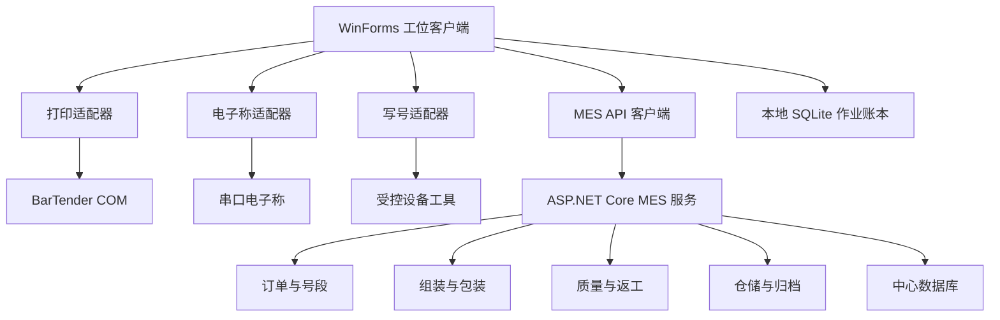
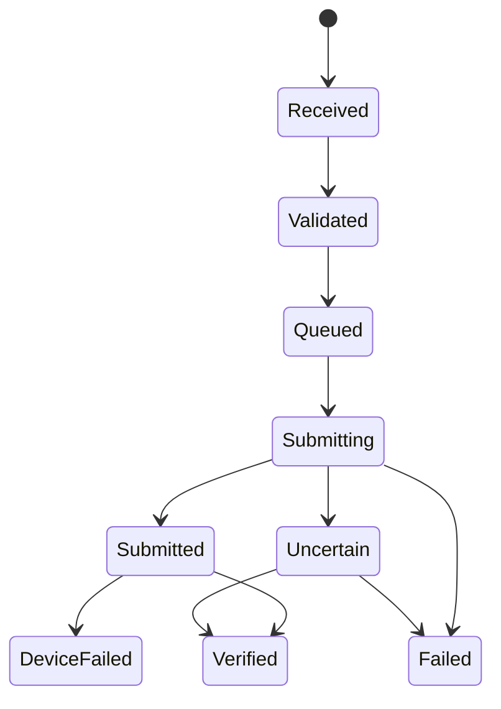

# MES 核心能力集成设计

Feature Name: mes-core-integration
Updated: 2026-08-15

## 1. 描述

本设计在现有 BarTenderPrinter 上增加中心 MES 服务、共享领域模型和设备适配边界。现有 WinForms 应用继续承担现场扫码、模板预览、BarTender 提交和本地诊断，中心服务承担全局一致性、跨工位流程和企业追溯。

MobileMes 的 PowerBuilder、Java、Qt、HASP、设备 DLL、证书、数据库和日志保持在隔离参考目录。新实现通过文档化协议连接获准使用的设备工具。

## 2. 架构



### 2.1 项目结构

```text
BarTenderPrinter/             现有 WinForms 工位客户端
BarTenderPrinter.Domain/      领域模型、状态机、规则和契约
BarTenderPrinter.MesApi/      ASP.NET Core 中心服务
BarTenderPrinter.Persistence/ 中心数据库仓储和迁移
BarTenderPrinter.Devices/     电子称与写号适配接口
BarTenderPrinter.Tests/       现有及领域单元测试
BarTenderPrinter.MesApi.Tests/ API 与持久化集成测试
```

首期可将领域代码保留在当前解决方案命名空间，待中心服务骨架建立后拆分项目。该策略缩短首期模型落地时间，并保持现有发布链稳定。

## 3. 组件与接口

### 3.1 订单与号段

```csharp
public interface IProductionOrderService
{
    ProductionOrder Create(CreateProductionOrder command);
    ProductionOrder Publish(string orderId, string operatorId);
    ProductionOrder Get(string orderId);
}

public interface INumberRangeService
{
    NumberAllocation Allocate(AllocateNumber command);
    NumberAllocation GetByIdempotencyKey(string idempotencyKey);
}
```

号码分配在中心数据库事务内完成。`NumberRange.NextValue` 使用并发令牌更新，分配记录以 `IdempotencyKey` 建立唯一索引。

### 3.2 过站服务

```csharp
public interface IStationPassService
{
    StationPassResult Pass(StationPassCommand command);
    IReadOnlyList<StationPassRecord> GetRouteHistory(string unitId);
}
```

过站验证顺序为订单状态、工位资格、产品状态、工艺路线、上一工序、重复结果和返工上下文。

### 3.3 包装聚合

`PackagingUnit` 作为聚合根，支持 `Body`、`ColorBox`、`Carton` 和 `Pallet` 层级。绑定操作携带聚合版本，中心数据库通过乐观并发控制同一箱或卡板的并发扫描。

### 3.4 打印作业账本

现有 `PrintJobRequest` 扩展以下字段：

- `JobId`
- `IdempotencyKey`
- `BatchId`
- `BatchItemId`
- `LabelType`
- `OriginalJobId`
- `ApprovalId`

执行流程：



本地 SQLite 账本先保存 `Received`，随后调用 `PrintJobCoordinator`。同键同摘要返回已有结果，同键异摘要返回冲突。

### 3.5 电子称适配器

```csharp
public interface IScaleAdapter : IDisposable
{
    Task<ScaleReading> ReadStableAsync(ScaleProfile profile, CancellationToken cancellationToken);
}
```

`ScaleProfile` 配置串口、波特率、数据长度、起止位置、单位、稳定窗口和超时。适配器只返回规范化读数，重量上下限由领域服务验证。

### 3.6 写号适配器

```csharp
public interface IIdentifierWriter
{
    Task<IdentifierWriteResult> WriteAndVerifyAsync(
        IdentifierWriteTask task,
        CancellationToken cancellationToken);
}
```

适配器通过供应商公开且获准使用的 CLI、SDK 或本地服务协议执行。命令参数使用结构化白名单，诊断输出经过脱敏后写入日志。

### 3.7 质量与返工

质量服务管理 `InspectionPlan`、`InspectionLot`、`InspectionResult` 和 `Disposition`。返工服务管理 `ReworkOrder` 和独立返工路线。质量冻结在包装绑定、打印和出库入口统一验证。

### 3.8 出库与归档

出库单以 `Shipment` 为聚合根，箱扫描使用幂等键和唯一箱约束。归档服务创建订单追溯快照，在线数据保留状态索引和归档位置。

## 4. 数据模型

### 4.1 核心实体

| 实体 | 关键字段 |
|---|---|
| ProductionOrder | Id、OrderNumber、Customer、ProductModel、Color、PlannedQuantity、Status、Version |
| NumberRange | Id、OrderId、NumberType、Prefix、DatePattern、Start、End、NextValue、Step、Version |
| NumberAllocation | Id、RangeId、Value、UnitId、StationId、Status、IdempotencyKey |
| ProductionUnit | Id、OrderId、SN、IMEI1..4、Status、CurrentOperation、Version |
| StationPassRecord | Id、UnitId、RouteId、OperationId、StationId、Result、OperatorId、OccurredAtUtc |
| PackagingUnit | Id、OrderId、Type、Code、Capacity、Status、Version |
| PackagingBinding | ParentId、ChildId、BoundAtUtc、OperatorId、Status |
| PrintJob | JobId、IdempotencyKey、LabelType、TemplateId、TemplateVersion、State、RequestHash |
| ScaleMeasurement | Id、PackagingUnitId、Weight、Unit、DeviceId、Result、MeasuredAtUtc |
| IdentifierWriteTask | Id、UnitId、IdentifiersJson、Platform、ToolVersion、State、RequestHash |
| InspectionLot | Id、OrderId、Type、SampleRule、State |
| InspectionResult | Id、LotId、UnitId、ItemCode、Result、DefectCode |
| ReworkOrder | Id、ReasonCode、RouteId、State、ApprovedBy |
| Shipment | Id、Customer、OrderId、PlannedQuantity、State、Version |
| ShipmentItem | ShipmentId、CartonId、ScannedAtUtc、OperatorId |
| AuditEvent | Id、ActorId、Action、EntityType、EntityId、BeforeJson、AfterJson、OccurredAtUtc |

### 4.2 唯一约束

- `ProductionOrder.OrderNumber` 在配置作用域内唯一。
- IMEI、SN、包装码和卡板码分别建立唯一索引。
- `NumberAllocation.IdempotencyKey` 唯一。
- `StationPassRecord.IdempotencyKey` 唯一。
- `PrintJob.IdempotencyKey` 唯一。
- 活动状态下，一个下级包装单元只关联一个父级包装单元。
- 活动状态下，一个卡通箱只关联一个出库单。

## 5. 正确性属性

1. 每个已分配号码对应唯一分配记录。
2. 每个正常路线过站记录满足前序工序条件。
3. 包装树保持无环结构，且每层符合允许的父子类型。
4. 包装单元的有效子项数量小于或等于配置容量。
5. 每个打印幂等键最多触发一次 BarTender 提交意图。
6. 补打作业关联一个原始打印作业和一个有效审批记录。
7. 写号成功记录包含一致的任务快照与回读结果。
8. 冻结产品或包装单元只进入授权的质量处置流程。
9. 已出库卡通箱拥有唯一有效出库明细。
10. 状态变更均生成对应审计事件。

## 6. 错误处理

- 业务错误使用稳定代码和操作员可读消息。
- 并发冲突返回当前版本和可重试标识。
- 设备调用区分连接失败、超时、协议错误、执行失败和未知结果。
- 打印与写号进入外部提交阶段后发生通信异常时，结果归类为 `Uncertain`。
- 本地账本保存失败时，工位停止新的外部提交并提示管理员处理。
- 中心服务记录关联 ID，用户界面展示脱敏错误摘要。

## 7. 安全设计

- 中心 API 使用身份认证、角色授权和工位身份绑定。
- 所有输入使用白名单验证，数据库访问使用参数化查询。
- IMEI、SN、证书标识和设备诊断按字段分类实施脱敏日志。
- 密钥、数据库凭据和设备服务凭据进入受保护配置存储。
- 导入文件限制扩展名、内容类型、大小、行数和列映射。
- 高风险操作包含原因码、审批人与审计事件。
- 设备适配器仅允许预注册工具和参数模板。

## 8. 测试策略

### 8.1 单元测试

- 号段边界、日期规则、步长和耗尽行为。
- 工艺路线与返工路线状态机。
- 包装层级、容量、重复绑定和并发版本。
- 打印幂等键、请求摘要和状态转换。
- 重量范围和稳定读数解析。
- 写号回读一致性。
- 出库数量和重复箱验证。

### 8.2 集成测试

- SQLite 和中心数据库事务与唯一约束。
- MES API 身份、权限、验证、幂等和错误契约。
- 打印账本与 `PrintJobCoordinator` 的提交前持久化。
- 模拟串口电子称和模拟写号适配器。
- 历史归档创建、校验和查询。

### 8.3 Windows 验收测试

- BarTender 模板字段、预览、打印和补打。
- 真实打印机队列及物理回执。
- 真实电子称串口协议。
- 获准设备工具的写入与回读。
- 网络中断、进程退出和恢复同步。

## 9. 分阶段实施

### 阶段 1：领域基础与打印闭环

- 订单、号段、生产单元和工艺路线模型。
- 组装过站和包装层级服务。
- 四类标签类型与模板注册表。
- 打印作业幂等账本。
- 统一追溯查询。

### 阶段 2：设备工位

- 电子称配置、稳定读数和重量验证。
- 写号任务、模拟适配器和回读验证。
- 设备诊断与人工核查队列。

### 阶段 3：质量与返工

- QA/OQC 抽检。
- 不良、冻结、处置和返工路线。
- 补打、返工和报废审批。

### 阶段 4：仓储与归档

- 出库单、箱扫描和库存状态。
- 历史归档、校验和跨域追溯。
- 统计指标和业务导出。

## 10. 关键决策

1. 推荐采用中心 MES 服务，支持跨工位唯一性和并发一致性。
2. 首期中心数据库采用 PostgreSQL，通过事务、唯一索引和乐观并发保障跨工位一致性。
3. 首期设备功能使用插件式模拟适配器完成状态机和自动化测试，真实适配器后续按获准协议替换。
4. 推荐现有 WinForms 保持工位客户端定位，管理端与统计端后续采用独立 Web UI。

## 11. 参考

[^1]: `README.md:1-82` - 当前打印工具能力和技术栈。
[^2]: `BarTenderPrinter/PrintJobCoordinator.cs:7-112` - 当前打印请求、执行与历史协调边界。
[^3]: `BarTenderPrinter/OrderManager.cs:11-79` - 当前订单和模板模型。
[^4]: `BarTenderPrinter/ServiceInterfaces.cs:7-39` - 当前打印与历史接口。
[^5]: `/tmp/opencode/mobilemes-analysis/MobileMes-static-analysis.md` - MobileMes 静态架构和业务流程分析。
