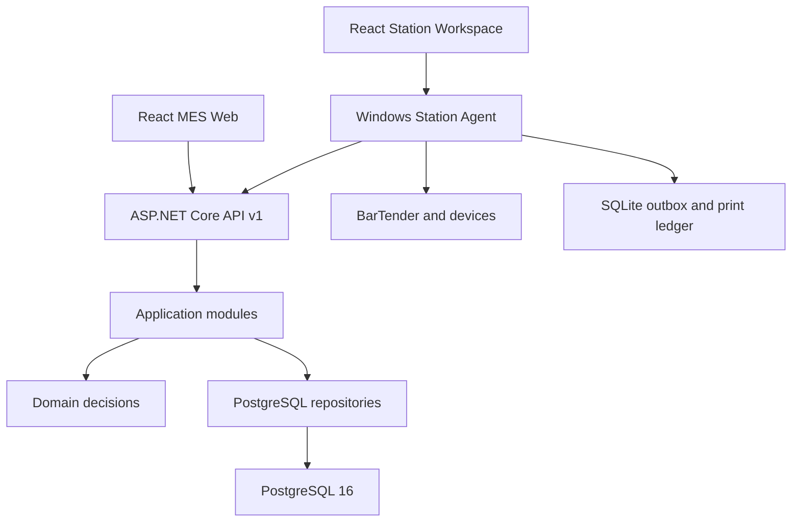

# MES 平台整体重构设计

Feature Name: mes-platform-rearchitecture
Updated: 2026-08-16

## Description

目标平台采用 React/TypeScript/Vite 统一交互层、ASP.NET Core 中心 API、PostgreSQL 权威存储和 Windows Station Agent。管理端按职能域组织，工位端按任务与扫码组织。现有 WinForms 在迁移期继续提供受控回退。

## Architecture



### 模块边界

```text
BarTenderPrinter.MesWeb
  app shell, design system, admin modules, station workspace

BarTenderPrinter.MesApi
  feature endpoints, authentication, authorization, OpenAPI, static hosting

BarTenderPrinter.Application
  command/query handlers, idempotency, audit, ports

BarTenderPrinter.Domain
  aggregates, state machines, value objects, domain decisions

BarTenderPrinter.Persistence
  PostgreSQL transactions, repositories, projections, migrations

BarTenderPrinter.StationAgent
  hardware API, offline outbox, print ledger, static station hosting
```

## Components and Interfaces

### Web Shell

- `moduleManifest` 作为路由、菜单、标题、图标和 Capability 的单一来源。
- 桌面使用永久导航轨，窄屏使用临时抽屉。
- 全局顶栏显示工位、班次、中心连接和待恢复操作。
- 管理模块和工位模块共享主题、认证与 API 客户端。

### Design Tokens

- Primitive：slate、emerald、amber、red、spacing、radius、elevation。
- Semantic：surface、text、border、action、success、warning、danger。
- Component：shell、metric card、scan field、status chip、data table。
- 字体采用系统中文字体与 `Fira Sans`/`Fira Code` 回退组合，数据编号使用等宽数字。

### API Modules

- `Orders`
- `MasterData`
- `Numbering`
- `Production`
- `Packaging`
- `Printing`
- `Quality`
- `Rework`
- `Warehouse`
- `Traceability`
- `DataExchange`
- `Identity`

新版模块注册在 `/api/v1`。旧 `/api` 入口继续调用同一 handler 或 repository，直到所有客户端完成迁移。

### Station Agent

- 本机 HTTP API 只监听 loopback。
- 设备 adapter 继续实现 `BarTenderPrinter.Devices` 契约。
- 打印逻辑迁入独立 Printing 项目后由 Agent 编排。
- SQLite outbox 保存离线命令、请求摘要、执行状态和同步结果。

## Data Models

### SessionCapabilities

```text
userId, displayName, stationId, shiftId, roles[], capabilities[]
```

### WorkspaceContext

```text
orderId, orderNumber, unitId, packageId, routeId, operationId, updatedAt
```

### OperationIntent

```text
id, type, idempotencyKey, requestHash, payload, status, createdAt, synchronizedAt
```

### ModuleManifest

```text
id, path, title, description, icon, capability, mode, children[]
```

## Correctness Properties

1. 相同幂等键和相同摘要返回首次业务结果。
2. 相同幂等键和不同摘要产生稳定冲突。
3. 状态变更和审计事件在同一 PostgreSQL 事务提交。
4. UI Capability 仅用于信息呈现，API Policy 保持授权边界。
5. Station Agent 在设备调用前持久化操作意图。
6. 待中心确认状态不会被界面呈现为最终业务成功。
7. 旧 API 与 v1 API 在迁移期共享相同业务规则。

## Error Handling

- API 统一返回 `code`、`message`、`correlationId`、`retryable` 和 `details`。
- Web API 客户端将网络失败、认证失败、业务冲突和字段验证错误映射为独立类型。
- 工位页面将错误紧邻当前任务显示，并提供重试或进入恢复队列的明确动作。
- Station Agent 使用 `Pending`、`Executing`、`Succeeded`、`Failed`、`Uncertain`、`PendingValidation` 状态机。

## Test Strategy

- Domain：规则和状态机单元测试。
- Application：handler、幂等和审计编排测试。
- Persistence：PostgreSQL 事务、并发和迁移测试。
- API：`WebApplicationFactory` 合约和权限测试。
- Web：Vitest + Testing Library 组件测试。
- E2E：Playwright 多视口关键流程。
- Station Agent：模拟设备、离线 outbox 和重启恢复测试。
- Windows：BarTender 和真实硬件专项验收。

## References

- https://github.com/jiujiezongheti/mes-api
- https://github.com/jiujiezongheti/mes-admin
- https://github.com/Rora-lyt/manufacturing-mes-api-automation
- https://react.dev/learn/typescript
- https://vite.dev/guide/build.html
- https://mui.com/material-ui/react-drawer/
- https://playwright.dev/docs/writing-tests
