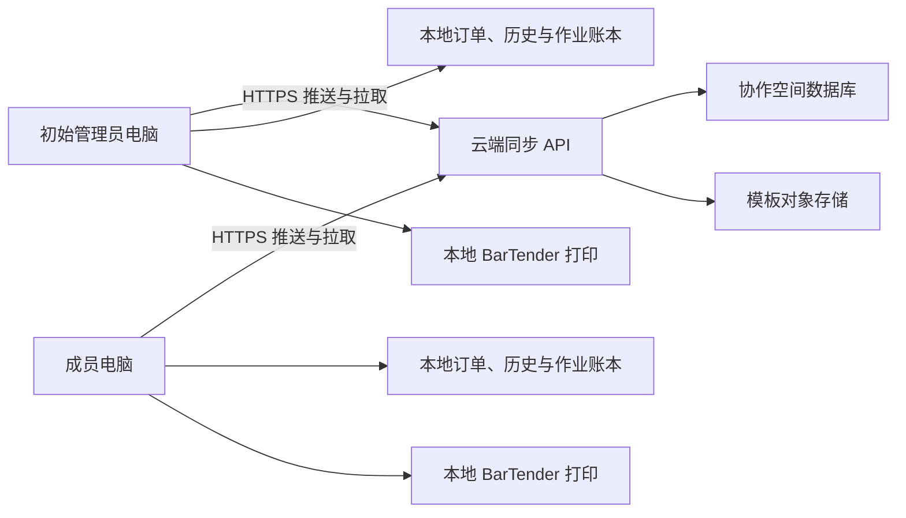

# 云端协作空间同步设计

> 状态：已被 `2026-08-17-encrypted-webdav-sync` 规格替代，后续实施以加密 WebDAV 数据包方案为准。

Feature Name: cloud-workspace-sync
Updated: 2026-08-17

## 描述

本设计在现有 WinForms 单机打印架构旁增加云端同步边界。客户端只主动发起 HTTPS 请求，因此无需固定 IP、端口映射、同一局域网或让初始管理员电脑持续在线。

推荐首版使用具有免费额度的托管 PostgreSQL、对象存储和 Serverless API 组合。Supabase 可作为默认实现，客户端通过项目自有 API 访问业务数据；服务端管理密钥仅存在于托管平台密钥配置中。云端接口保持供应商无关，后续可迁移到其他托管服务。

已确认首版由产品所有者账号持有云端项目，目标规模为最多 5 台成员电脑和 500MB 模板文件总量。容量预警阈值设为 400MB，达到 500MB 时暂停新增模板版本上传，订单、历史和作业状态等小型数据继续同步。

## 架构

云端服务是可达性中继和共享数据权威。每台客户端保存完整可用的本地快照、模板缓存、同步队列和同步游标。打印提交始终发生在当前电脑，本地 `SqlitePrintJobLedger` 保持最终打印状态的设备级权威。

## 设计决策

### 协作关系

- “主电脑”在产品界面中称为“初始管理员电脑”。
- 初始管理员电脑创建协作空间并生成短期一次性共享码。
- 后续成员加入后直接连接云端服务，日常同步不依赖初始管理员电脑在线。
- 管理员可以生成新共享码、查看成员、调整角色和撤销设备。

### 同步模型

- 订单、业务设置采用带版本号的实体同步。
- 模板文件采用 SHA-256 内容寻址和不可变版本。
- 打印历史、打印作业状态和审计记录采用仅追加事件同步。
- 每次客户端写入携带全局事件 ID，服务端通过唯一约束实现幂等。
- 每个协作空间维护单调递增变更序号，客户端通过同步游标增量拉取。
- 客户端先拉取、处理冲突，再上传本地队列，降低基于旧版本写入的概率。

### 设备本地数据

以下值保留在当前电脑，不由共享设置直接覆盖：

- 打印机名称与纸张相关映射。
- 本地模板缓存路径和外部模板源路径。
- Windows 窗口状态、日志路径和设备凭证。
- 本地 `Submitting` 恢复状态和打印调用过程数据。

共享的 `TemplatePath` 转换为逻辑模板 ID 与版本 ID。下载完成后，由客户端解析为本机缓存路径，避免同步其他电脑的绝对路径。

## 组件与接口

### 客户端组件

| 组件 | 职责 |
|---|---|
| `WorkspaceManager` | 创建、加入、退出协作空间，维护成员与角色信息 |
| `DeviceCredentialStore` | 使用 Windows DPAPI 保存设备凭证 |
| `CloudSyncClient` | 调用 HTTPS API，执行超时、重试和错误映射 |
| `SyncCoordinator` | 管理拉取、上传、游标、队列和同步互斥 |
| `SyncOutbox` | 在本地 SQLite 持久化待上传事件及重试状态 |
| `ConflictManager` | 保存冲突快照并驱动人工选择或字段合并 |
| `TemplateCache` | 下载、摘要校验、版本切换和旧版本保留 |
| `DeviceOverrides` | 保存本机打印机与路径映射 |

### 云端 API

| 方法与路径 | 作用 |
|---|---|
| `POST /v1/workspaces` | 创建协作空间与初始管理员设备 |
| `POST /v1/workspaces/{id}/invite-codes` | 生成或轮换共享码 |
| `POST /v1/devices/join` | 使用共享码注册成员电脑 |
| `GET /v1/workspaces/{id}/devices` | 查询成员电脑 |
| `POST /v1/workspaces/{id}/devices/{deviceId}/revoke` | 撤销成员电脑 |
| `GET /v1/sync/changes?cursor={cursor}` | 增量获取变更事件 |
| `POST /v1/sync/events` | 幂等上传一批本地事件 |
| `POST /v1/templates/uploads` | 获取受限模板上传授权 |
| `GET /v1/templates/{versionId}/download` | 获取受限模板下载授权 |
| `GET /v1/workspaces/{id}/usage` | 查询空间用量和免费额度状态 |

所有 API 请求携带设备访问令牌、请求 ID 和客户端版本。服务端从已验证设备身份推导 `WorkspaceId`，客户端提交的租户字段只参与一致性校验。

## 数据模型

### 云端实体

| 实体 | 关键字段 |
|---|---|
| `Workspace` | `Id`, `Name`, `CreatedAtUtc`, `Revision`, `PlanState` |
| `Device` | `Id`, `WorkspaceId`, `Name`, `Role`, `CredentialHash`, `RevokedAtUtc`, `LastSeenAtUtc` |
| `InviteCode` | `Id`, `WorkspaceId`, `CodeHash`, `ExpiresAtUtc`, `RemainingUses`, `RevokedAtUtc` |
| `SharedEntity` | `WorkspaceId`, `EntityType`, `EntityId`, `Version`, `PayloadJson`, `UpdatedByDeviceId`, `UpdatedAtUtc` |
| `TemplateVersion` | `Id`, `WorkspaceId`, `TemplateId`, `Sha256`, `Size`, `ObjectKey`, `CreatedByDeviceId` |
| `SyncEvent` | `Sequence`, `EventId`, `WorkspaceId`, `DeviceId`, `EntityType`, `EntityId`, `BaseVersion`, `EventType`, `PayloadJson` |
| `PrintEvent` | `EventId`, `WorkspaceId`, `DeviceId`, `JobId`, `IdempotencyKey`, `State`, `PayloadJson`, `OccurredAtUtc` |
| `AuditEvent` | `Id`, `WorkspaceId`, `ActorDeviceId`, `Action`, `TargetId`, `OccurredAtUtc` |

数据库对 `(WorkspaceId, EventId)`、`(WorkspaceId, JobId)` 和 `(WorkspaceId, TemplateId, Sha256)` 建立唯一约束。所有共享表启用租户隔离策略。

### 客户端状态

| 数据 | 存储 |
|---|---|
| 工作空间与设备元数据 | `workspace.json` |
| 加密设备凭证 | Windows DPAPI 保护文件 |
| 同步队列、游标和冲突 | `sync.db` |
| 模板版本缓存 | `templates/{templateId}/{versionId}.btw` |
| 设备本地覆盖 | `device-overrides.json` |
| 订单、历史和作业账本 | 现有文件与 SQLite 数据库 |

## 同步流程

### 创建与加入

1. 初始电脑生成本地设备密钥并调用创建协作空间接口。
2. 服务端返回工作空间标识、设备凭证和限时共享码。
3. 后续电脑提交共享码、设备名称和设备公钥。
4. 服务端消费共享码并返回成员设备凭证。
5. 新成员执行全量快照同步并下载当前模板版本。
6. 新成员完成打印机映射后进入可打印状态。

### 常规同步

1. `SyncCoordinator` 获取单实例同步锁。
2. 客户端按游标拉取远端变更并写入事务性暂存区。
3. 客户端验证实体 schema、模板摘要和事件连续性。
4. 客户端应用无冲突变更并保存冲突快照。
5. 客户端按顺序上传本地 outbox 事件。
6. 客户端删除已确认 outbox 项并提交新游标。
7. 客户端更新同步状态栏和诊断指标。

## 冲突策略

| 数据类型 | 处理策略 |
|---|---|
| 订单字段 | 显示本地值、云端值和差异，人工逐字段选择 |
| 业务设置 | 按设置分组显示差异，人工确认新版本 |
| 模板文件 | 两个二进制版本并存，人工选择订单引用版本 |
| 打印历史 | 仅追加，以 `RecordId` 幂等合并 |
| 打印作业事件 | 仅追加，以 `JobId` 和事件 ID 幂等合并 |
| 设备本地设置 | 每台电脑独立保存 |

## 正确性属性

1. 已确认同步事件在同一协作空间内只产生一次业务效果。
2. 客户端只应用 SHA-256 与元数据一致的模板文件。
3. 本地打印状态机不因云端请求失败改变已保存终态。
4. `Submitting` 状态的崩溃恢复继续转换为本地 `Uncertain`。
5. 任一共享实体版本从 `n` 更新到 `n + 1` 时，提交的基础版本必须等于 `n`。
6. 已撤销设备无法读取新变更或提交新事件。
7. 客户端提交同步游标前，游标范围内的变更必须完成本地事务提交。

## 安全设计

- 全部通信使用 TLS 1.2 或更高版本。
- 共享码至少包含 128 位随机熵，界面可使用分组编码降低输入错误。
- 共享码默认 15 分钟有效且只允许使用一次。
- 设备凭证使用短期访问令牌和可轮换刷新凭证。
- Windows 客户端使用 DPAPI CurrentUser 范围保护刷新凭证。
- 模板上传限制为 `.btw` 扩展名、配置容量上限和服务端对象键。
- 对象存储使用短期签名 URL，存储桶保持私有。
- 服务端对加入、同步、上传和管理接口实施设备级速率限制。
- 日志隐藏共享码、访问令牌、刷新凭证、字段业务值和模板内容。
- 客户端只包含公开 API 地址和公开客户端标识，服务端管理密钥由托管平台保管。

## 错误处理

| 场景 | 客户端行为 |
|---|---|
| 网络超时 | 指数退避重试，保留 outbox 和当前游标 |
| 免费服务暂停 | 显示云同步暂停，本地打印继续工作 |
| 凭证过期 | 自动刷新一次，失败后要求重新授权设备 |
| 设备被撤销 | 停止同步，锁定共享写入，保留本地备份 |
| 模板校验失败 | 隔离下载文件并继续使用最近有效版本 |
| 实体版本冲突 | 创建冲突记录并暂停该实体后续上传 |
| 容量超限 | 暂停新增模板上传，继续同步小型元数据和状态 |
| schema 版本过新 | 保留原始事件并提示升级客户端 |

## 免费零配置边界

用户端体验可以做到安装后只输入共享码。项目交付仍包含一次性云端准备工作：

1. 创建免费托管项目。
2. 部署数据库迁移、租户隔离策略、Serverless API 和私有模板存储桶。
3. 将公开 API 地址和公开客户端标识写入发布配置。
4. 将服务端密钥写入托管平台的 Secret 配置。
5. 配置免费额度预警、备份导出和服务暂停恢复流程。

首版按 5 台电脑和 500MB 模板总量验收。免费计划适用于该规模的功能验证与小团队使用；实际可用额度以云服务商当前政策为准。正式生产需要根据月流量、备份、服务暂停策略和可用性目标评估付费计划。

## 测试策略

### 单元测试

- 共享码生成、摘要、有效期和消费次数。
- 实体版本比较、字段差异和冲突创建。
- outbox 幂等、重试、顺序和游标提交。
- 模板 SHA-256 校验和缓存版本切换。
- 设备本地覆盖合并。
- 凭证加密存储和日志脱敏。

### 集成测试

- 创建空间、加入设备、撤销设备完整流程。
- 两台模拟客户端增量同步和断点续传。
- 同订单并发编辑产生冲突且双方版本完整保留。
- 同模板并发上传产生两个可选择版本。
- 历史和作业事件重复上传保持单条业务记录。
- 跨协作空间访问被租户策略拒绝。
- 对象上传大小、扩展名和签名 URL 过期校验。

### Windows 客户端测试

- DPAPI 凭证只能由对应 Windows 用户解密。
- 离线状态下订单、模板、打印和本地账本保持可用。
- 联网后打印事件按顺序补传。
- 新成员完成模板下载和打印机映射后可以预览与打印。
- `Uncertain` 和补打印审批链在多电脑历史视图中完整展示。

### 端到端验收

1. 两台电脑位于不同公网网络。
2. 第一台电脑创建协作空间并生成共享码。
3. 第二台电脑仅输入共享码和设备名称完成加入。
4. 任一电脑新增订单及模板，另一台电脑完成同步、预览和打印。
5. 两台电脑离线修改同一订单，恢复联网后出现可处理冲突。
6. 管理员撤销第二台电脑，第二台电脑后续同步请求被拒绝。

## 实施阶段

1. 建立云端 schema、租户隔离、设备认证和共享码 API。
2. 实现客户端工作空间管理、凭证存储和同步状态界面。
3. 实现订单、业务设置和模板版本同步。
4. 实现打印历史、作业状态和补打印审计同步。
5. 实现冲突中心、成员管理、容量预警和诊断。
6. 完成跨公网双机端到端验证及发布迁移方案。
