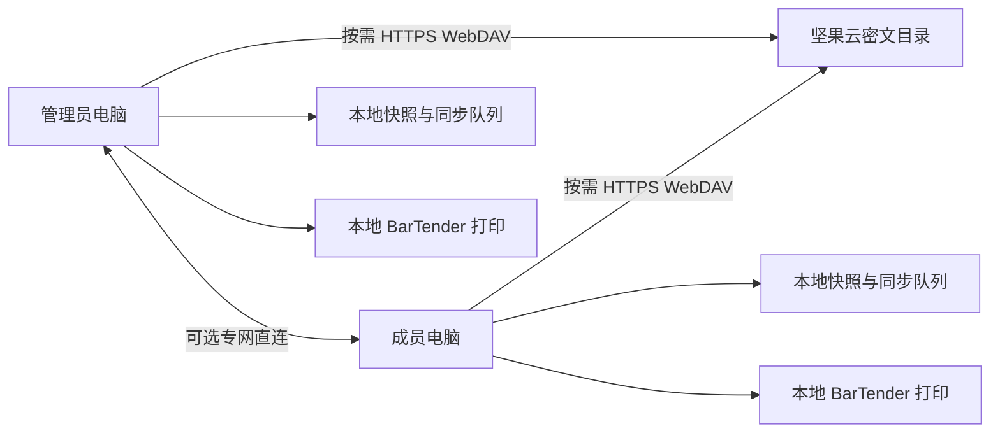

# 加密 WebDAV 数据包同步设计

Feature Name: encrypted-webdav-sync
Updated: 2026-08-17

## 描述

首版采用坚果云 WebDAV 作为国内免费存储。项目不部署云数据库和业务服务。各客户端只在需要同步时通过 HTTPS 读取或写入不可变加密对象，随后结束网络请求。可选专网直连通道自动收集本机候选 IP，并通过 WebDAV 中的加密设备记录交换 IP 和端口；端点可达时客户端直接交换相同的加密同步对象。

坚果云免费版公开限制适合 5 台电脑低频同步：每月约 1GB 上传、3GB 下载、单文件 500MB、每 30 分钟 600 次请求。应用通过增量事件、模板内容去重、请求合并和本地缓存控制流量。

## 架构



WebDAV 是默认密文对象交换区和设备端点登记区。本地 SQLite 和文件系统保存可运行快照、打印账本、同步队列、游标、冲突和模板缓存。专网直连复用同一对象格式、事件 ID、摘要和冲突规则，因此切换通道不会产生第二套业务状态。

## 用户设置流程

### 管理员电脑

1. 注册或登录坚果云。
2. 在“账户信息 > 安全选项 > 第三方应用管理”生成应用密码。
3. 在应用向导中填写坚果云邮箱和应用密码。
4. 应用验证 `https://dav.jianguoyun.com/dav/` 的读写权限。
5. 应用创建协作空间并生成数据密钥。
6. 管理员设置共享密码并导出 `.btpsync` 连接文件。

### 成员电脑

1. 获取 `.btpsync` 连接文件。
2. 在应用中导入连接文件并输入共享密码。
3. 应用解密连接配置并使用 DPAPI 重新加密到本机。
4. 应用完成首次同步、模板下载和打印机映射。

### 可选专网直连

1. 用户在每台电脑的“同步设置 > 专网直连”中启用直连并设置监听端口。
2. 应用读取处于运行状态且具有默认路由的网卡，收集符合规则的 IPv4 和 IPv6 单播地址。
3. 用户在 Windows 防火墙中允许该应用的专用网络入站连接。
4. 应用将候选地址、监听端口和有效期写入 `devices/{device-id}.enc`。
5. 其他电脑通过 WebDAV 获取该记录，并按优先级自动尝试目标设备的候选端点。
6. 任一端点认证成功后，当前同步使用直连通道；全部端点失败时回退 WebDAV。

## 远程目录结构

```text
BarTenderPrinterSync/
  spaces/{space-id}/
    space.enc
    devices/{device-id}.enc
    events/{device-id}/{sequence}.evt
    templates/{sha256}.btw.enc
    snapshots/{snapshot-id}.snap
    snapshot-pointer.enc
```

对象名只暴露随机空间、设备、序号和摘要标识。订单名称、字段值、模板文件名、打印内容和账号信息均位于密文内部。

`devices/{device-id}.enc` 包含设备显示名称、候选 IP 列表、地址族、网卡类型、地址优先级、TCP 端口、端点版本、更新时间、有效期和启用状态。设备记录不包含网卡硬件地址、Windows 用户名、WebDAV 应用密码或数据密钥。

候选地址过滤规则：

- 保留处于运行状态且具有默认路由的网卡单播地址。
- 排除 `127.0.0.0/8`、`169.254.0.0/16`、IPv6 环回、IPv6 链路本地、组播和未指定地址。
- 优先使用上次成功端点，其次使用私有 IPv4，再使用其他有效单播地址。
- 同一地址仅发布一次，默认有效期为 24 小时。

## 加密格式

### 数据对象

- 算法：AES-256-GCM。
- 数据密钥：创建空间时使用 CSPRNG 生成 32 字节随机值。
- Nonce：每个对象生成 12 字节随机值，同一密钥下禁止复用。
- 关联数据：格式版本、空间 ID、对象类型和对象 ID。
- 明文在加密前使用 UTF-8 JSON 或原始模板字节表示。
- 对象头包含格式版本、nonce、密文长度和认证标签。

### 连接文件

- 文件扩展名：`.btpsync`。
- 密钥派生：PBKDF2-HMAC-SHA256，随机 16 字节 salt，至少 600,000 次迭代。
- 加密内容：WebDAV 地址、账号、应用密码、空间 ID、数据密钥和格式版本。
- 连接文件不保存共享密码。
- 导入成功后，原始配置使用 Windows DPAPI CurrentUser 保护并写入本机。

## 同步协议

### 通道选择

1. WebDAV 始终可由用户手动触发，并承担端点记录交换。
2. 启用专网直连时，客户端读取目标设备最新端点记录。
3. 客户端按上次成功、私有 IPv4 和其他单播地址的顺序尝试有效端点。
4. 每个候选端点使用独立短超时，连接成功后执行双向认证和能力协商。
5. 认证成功后停止尝试其余端点，并复用事件拉取、模板对象传输和游标提交逻辑。
6. 连接失败时尝试下一候选端点；认证失败时终止该设备的本轮直连。
7. 全部候选端点失败时关闭套接字并切换到 WebDAV。

### 事件生成

每台设备维护本地单调递增序号。业务变更先提交本地数据和 outbox 事务，再生成：

```text
EventId = DeviceId + Sequence
BaseVersion = 编辑开始时的实体版本
EntityId = 订单、设置、历史或作业的稳定 ID
```

事件对象不可变。上传目标已存在时，客户端比较密文摘要；摘要一致视为幂等成功，摘要不同进入安全错误状态。

### 拉取与应用

1. 获取设备清单及每台设备最新序号。
2. 根据本地游标仅列举缺失事件区间。
3. 批量下载缺失事件并完成认证解密。
4. 在本地事务中按设备序号和事件时间应用事件。
5. 保存冲突快照和新游标。
6. 上传本地 outbox 中尚未确认的事件。
7. 下载当前订单引用但本机缺失的模板对象。

同步流程使用单实例互斥锁。网络失败时保留 outbox 和旧游标，下次从已确认位置继续。

## 多机冲突

事件包含实体基础版本。当前实体版本与 `BaseVersion` 一致时直接应用；版本更高且字段集合发生重叠时创建冲突。

| 数据 | 策略 |
|---|---|
| 订单 | 显示字段差异，人工选择或合并 |
| 共享设置 | 按设置分组人工确认 |
| 模板 | 内容摘要形成独立版本，人工选择引用 |
| 打印历史 | 以 `RecordId` 仅追加合并 |
| 作业状态 | 以 `JobId` 和状态事件仅追加合并 |
| 本地设备设置 | 保持设备独立 |

## 快照与清单

事件累计达到 500 条或密文总量达到 20MB 时，管理员设备可生成加密快照。快照包含已合并业务状态和各设备游标。

`snapshot-pointer.enc` 使用 WebDAV ETag 和 `If-Match` 条件更新。条件失败时重新读取远端指针并比较快照覆盖范围。旧事件和快照首版继续保留，清理功能需要管理员确认后单独设计。

## 客户端组件

| 组件 | 职责 |
|---|---|
| `ICloudObjectStore` | 列举、读取、创建和条件更新对象 |
| `WebDavObjectStore` | 封装 PROPFIND、GET、PUT、MKCOL 和 ETag |
| `DirectSyncHost` | 在自动筛选的本机地址和用户确认的端口监听已授权设备连接 |
| `DirectSyncClient` | 连接目标设备发布的候选端点并执行认证、清单和对象传输 |
| `DeviceEndpointRegistry` | 加密发布、读取和验证设备端点版本 |
| `LocalEndpointCollector` | 读取本机网卡、过滤地址并生成有序候选端点 |
| `SyncCrypto` | AES-GCM、PBKDF2、对象格式和摘要校验 |
| `ConnectionProfileStore` | 导入导出连接文件及 DPAPI 本地存储 |
| `SyncOutbox` | SQLite 持久化本地事件和重试状态 |
| `SyncCoordinator` | 执行拉取、合并、上传、模板下载和游标提交 |
| `ConflictManager` | 保存并呈现待处理冲突 |
| `TemplateObjectCache` | 管理加密模板下载和本地明文缓存 |
| `DeviceOverrides` | 保存打印机和本地路径覆盖值 |

## 本地文件

| 路径 | 内容 |
|---|---|
| `sync-profile.dat` | DPAPI 加密连接配置 |
| `sync.db` | outbox、设备游标、冲突和同步诊断 |
| `template-cache/{sha256}.btw` | 已验证的本地模板缓存 |
| `device-overrides.json` | 本机打印机与路径配置 |

## 业务数据映射

| 现有数据 | 同步实体 | 同步方式 | 本地权威 |
|---|---|---|---|
| `orders.json` | `Order` | 版本化事件和周期快照 | 最近已合并版本 |
| `template_settings.json` | `TemplateSettings` | 版本化事件 | 最近已合并版本 |
| `.btw` 文件 | `TemplateObject` | SHA-256 内容寻址对象 | 已校验模板缓存 |
| `print_records.db` | `PrintRecord` | 仅追加事件 | 记录产生设备 |
| `print_jobs.db` | `PrintJobEvent` | 仅追加状态事件 | 作业执行设备 |
| 补打印审批字段 | `ReprintAudit` | 仅追加事件 | 审批及执行设备 |
| 打印机和本地路径 | `DeviceOverride` | 保持本机 | 当前设备 |
| `application-state.json` | `ApplicationState` | 保持本机 | 当前设备 |

订单和模板设置中的绝对 `TemplatePath` 不直接传播。同步事件保存 `TemplateId`、`TemplateVersionId` 和明文内容 SHA-256；接收设备完成模板下载与校验后，将逻辑引用解析为本机 `template-cache` 路径。

## 数据契约

### 空间元数据

```json
{
  "schemaVersion": 1,
  "spaceId": "随机空间标识",
  "createdAtUtc": "ISO-8601 UTC",
  "cryptoSuite": "AES-256-GCM",
  "minimumClientVersion": "5.8.0"
}
```

### 设备端点记录

```json
{
  "schemaVersion": 1,
  "spaceId": "空间标识",
  "deviceId": "设备标识",
  "displayName": "电脑显示名称",
  "endpointVersion": 7,
  "directSyncEnabled": true,
  "port": 45873,
  "certificateSha256": "TLS 证书指纹",
  "addresses": [
    {
      "value": "10.20.30.40",
      "family": "IPv4",
      "interfaceType": "Ethernet",
      "priority": 100
    }
  ],
  "publishedAtUtc": "ISO-8601 UTC",
  "expiresAtUtc": "ISO-8601 UTC"
}
```

### 同步事件

```json
{
  "schemaVersion": 1,
  "eventId": "device-id:sequence",
  "deviceId": "设备标识",
  "sequence": 42,
  "entityType": "Order",
  "entityId": "业务对象标识",
  "operation": "Upsert",
  "baseVersion": 3,
  "newVersion": 4,
  "occurredAtUtc": "ISO-8601 UTC",
  "payload": {}
}
```

删除共享业务对象使用 `operation = Tombstone` 事件，并保留实体 ID、基础版本、删除人设备和时间。墓碑进入快照且首版不执行自动永久清理。

## 本地同步数据库

`sync.db` 至少包含以下表：

| 表 | 关键字段 | 用途 |
|---|---|---|
| `SyncOutbox` | `EventId`, `Sequence`, `ObjectPath`, `EncryptedBlob`, `State`, `RetryCount` | 保存一次生成的加密事件字节，确保重试字节一致 |
| `DeviceCursors` | `RemoteDeviceId`, `LastAppliedSequence` | 记录各设备增量游标 |
| `EntityVersions` | `EntityType`, `EntityId`, `Version`, `ContentHash` | 执行乐观并发判断 |
| `SyncConflicts` | `ConflictId`, `EntityId`, `LocalJson`, `RemoteJson`, `State` | 保存冲突双方快照 |
| `KnownDevices` | `DeviceId`, `EndpointVersion`, `EndpointJson`, `LastResult` | 缓存设备端点及连接结果 |
| `SyncUsage` | `Period`, `UploadedBytes`, `DownloadedBytes`, `RequestCount` | 免费额度预警 |
| `AppliedEvents` | `EventId`, `AppliedAtUtc` | 提供额外幂等保护 |
| `QuarantinedObjects` | `ObjectPath`, `SafeErrorCode`, `FirstSeenAtUtc`, `LastSeenAtUtc`, `OccurrenceCount` | 保存损坏对象的脱敏隔离记录 |
| `SnapshotState` | `LastEventCount`, `LastEncryptedBytes`, `LastSnapshotId` | 保存快照阈值基线 |

业务写入和 outbox 事件登记应位于同一逻辑提交中。现有 JSON 管理器无法与 SQLite 共享物理事务时，先原子写业务文件，再写 outbox；启动恢复程序比较实体版本与 outbox，补建缺失事件。

## 直连服务设计

### 生命周期

- 专网直连默认关闭。
- 用户启用后，`DirectSyncHost` 仅在主程序运行期间监听。
- 主程序最小化时监听保持可用，主程序退出、电脑休眠或网络断开时监听结束。
- 监听空闲期间不传输业务数据，仅占用本地 TCP 端口。
- WebDAV 同步不依赖直连服务在线。
- 新地址出现或旧地址消失时，主程序重建监听集合并提高端点版本。

### 监听端口

- 默认端口为 `45873`，用户可修改。
- 启动时先检查端口占用，失败后显示中文错误并保持 WebDAV 可用。
- 应用发布的端口必须与实际成功监听端口一致。
- 安装程序可提供“允许专网直连”选项，用户确认后为专用网络创建应用级防火墙规则。
- 公用网络配置下默认不开放入站规则。

### TLS 与身份验证

每台设备首次加入空间时生成 ECDSA P-256 设备密钥和自签名 TLS 证书。私钥使用 DPAPI CurrentUser 保存，证书 SHA-256 指纹进入加密设备记录。

1. 客户端连接设备端点并开始 TLS 1.2 或 TLS 1.3 握手。
2. 客户端要求服务端证书指纹与 WebDAV 设备记录完全一致。
3. 双方交换随机挑战值、设备 ID、空间 ID 和协议版本。
4. 双方使用从数据密钥经 HKDF-SHA256 派生的认证密钥计算 HMAC。
5. 双方使用设备私钥签名本轮握手摘要。
6. 验证通过后，双方经 HKDF 派生本轮会话密钥和方向独立 nonce 前缀。
7. 验证失败时立即关闭连接并记录脱敏诊断。

设备私钥证明具体设备身份，空间 HMAC 证明双方属于同一协作空间，TLS 指纹固定目标设备，随机挑战阻止握手重放。

### 传输协议

直连使用长度前缀二进制帧，避免任意路径和任意命令执行。每个帧包含协议版本、消息类型、请求 ID、载荷长度和认证载荷。

| 消息 | 作用 |
|---|---|
| `Hello` | 交换设备、空间、版本和随机挑战 |
| `Authenticate` | 提交 HMAC 与设备签名 |
| `InventoryRequest` | 请求设备游标、事件范围和模板摘要 |
| `InventoryResponse` | 返回可提供对象清单 |
| `ObjectRequest` | 请求指定对象 ID |
| `ObjectChunk` | 传输加密对象分块 |
| `ObjectComplete` | 提交对象大小和 SHA-256 |
| `SyncReceipt` | 确认已持久化的事件游标 |
| `Error` | 返回稳定错误码和安全消息 |

- 控制帧上限为 1MB。
- 单个对象分块默认为 1MB。
- 每个对象落盘前验证声明大小、密文摘要和 AES-GCM 认证。
- 临时文件写入 `sync-staging`，完整验证后原子移动到正式缓存。
- 请求只能引用协议清单中的对象 ID，服务端不接受客户端文件系统路径。
- 单连接并发对象数首版限制为 2，降低打印电脑资源占用。

## 自动端点采集

`LocalEndpointCollector` 订阅 Windows 网络地址变化事件，并在应用启动、直连启用、网络变化和手动同步前刷新候选地址。

采集流程：

1. 枚举 `OperationalStatus.Up` 的网络接口。
2. 读取具有有效网关或默认路由的接口单播地址。
3. 应用环回、链路本地、组播、未指定和重复地址过滤。
4. 将上次直连成功地址优先级设为最高。
5. 私有 IPv4 按以太网、Wi-Fi、其他接口排序。
6. 保留有效全局 IPv6 地址，连接时处理作用域信息。
7. 地址集合变化时增加 `EndpointVersion` 并写入本地待发布状态。
8. 下一次 WebDAV 同步上传完整加密设备记录。

端点记录的默认有效期为 24 小时。每次成功 WebDAV 同步可刷新发布时间；地址集合未变化时仍生成新的密文设备记录，以延长有效期并更新在线状态。

## 同步编排

### 自动同步触发

| 触发 | 行为 |
|---|---|
| 应用启动 | 延迟至 UI 可用后执行一次增量 WebDAV 同步 |
| 保存共享数据 | 先写 outbox，防抖 10 秒后执行上传 |
| 手动立即同步 | 立即执行端点刷新、直连尝试和 WebDAV 补齐 |
| 应用退出 | 最多等待 5 秒上传小型待处理事件 |
| 网络恢复 | 等待网络稳定 15 秒后执行一次增量同步 |
| 定时器 | 默认关闭固定周期轮询 |

### 完整同步顺序

1. 获取进程内同步互斥锁。
2. 检查本地数据迁移和 outbox 恢复。
3. 通过 WebDAV 拉取空间元数据与设备端点记录。
4. 校验空间 ID、格式版本、对象认证和端点有效期。
5. 对启用直连的目标设备按优先级尝试候选端点。
6. 通过直连拉取可获得的缺失事件和模板对象。
7. 通过 WebDAV 拉取直连未覆盖的缺失对象。
8. 在本地事务中应用事件、生成冲突并推进游标。
9. 优先通过已认证直连上传 outbox，随后通过 WebDAV 补齐。
10. 上传本机最新设备端点记录和同步摘要。
11. 更新流量、请求数、最近成功时间和通道结果。
12. 释放同步锁并刷新 UI。

直连是传输加速通道，WebDAV 是最终交换通道。一次同步可以混合使用两个通道，同一对象通过摘要和事件 ID 幂等去重。

## UI 设计

### 导航集成

侧边栏增加与现有入口同级的“同步中心”按钮，顺序为：

1. 打印页面。
2. 订单管理。
3. 同步中心。

同步中心使用统一线性风格的同步图标，并复用 `MiuiTheme.StyleNavigationButton` 的普通、悬停和选中状态。侧边栏展开后显示图标与文字；侧边栏入口的右侧可显示待处理数量，例如“同步中心 3”。数量来源为待上传事件和未解决冲突的去重总数，最大显示为 `99+`。

页面切换遵循单一活动页面规则：`_printPagePanel`、`_orderPagePanel` 和 `_syncPagePanel` 同一时刻仅一个可见。进入同步中心时关闭打印预览开关，切换前继续执行订单编辑器未保存确认。切换页面只改变可见性和导航选中态，不销毁页面控件或正在运行的同步任务。

### 页面总体结构

```text
┌──────────────────────────────────────────────────────────────┐
│ 同步中心                     最近同步时间       [立即同步]  │
│ WebDAV 默认通道，可用时优先专网直连             [更多操作]  │
├──────────────────────────────────────────────────────────────┤
│ [同步状态] [待上传] [设备数量] [冲突数量]                    │
├──────────────────────────────────────────────────────────────┤
│ [概览] [设备与直连] [连接设置] [冲突处理] [用量与诊断]      │
├──────────────────────────────────────────────────────────────┤
│                                                              │
│                  当前页签的纵向滚动内容                      │
│                                                              │
└──────────────────────────────────────────────────────────────┘
```

顶级容器 `_syncPagePanel` 与订单页同级，锚定工作区四边。容器内部从上到下分为固定页头、指标卡区、页签导航和唯一滚动内容区。固定区域总高度经过 DPI 缩放，内容区使用 `DockStyle.Fill` 和 `AutoScroll = true`。

### 页面头部

页面头部左侧显示“同步中心”、空间名称、本机设备名称和简短状态说明。右侧显示最近成功同步时间、主要按钮“立即同步”和次要操作菜单。

“立即同步”运行期间显示“正在同步”，按钮保持禁用并提供独立“取消”按钮。完成后在页面状态区显示成功、部分成功或失败信息。状态使用图标、文字和颜色共同表达。

更多操作包含：

- 发布本机直连信息。
- 导出连接文件。
- 导出脱敏诊断。
- 退出协作空间。

退出协作空间位于菜单末尾并使用危险操作样式，执行前显示确认对话框。

### 指标卡片

首行显示四张等宽指标卡：

| 卡片 | 主值 | 辅助信息 |
|---|---|---|
| 同步状态 | 已同步、同步中、离线可用、需要处理 | 当前通道和结果码 |
| 待上传 | outbox 事件数量 | 预计上传大小 |
| 设备数量 | 有效设备数量 | 可直连设备数量 |
| 冲突数量 | 未解决冲突数量 | 最早冲突时间 |

可用宽度大于等于 `ScaleUi(920)` 时使用四列；`ScaleUi(620)` 至 `ScaleUi(919)` 时使用两列；更窄时使用单列。卡片高度由内容决定且每行统一，不使用固定绝对位置堆叠。

### 页签一：概览

概览按优先级展示：

1. 当前同步进度和正在处理的对象类型。
2. 最近一次同步结果及 WebDAV、直连各自完成量。
3. 待处理事项，包括连接失效、模板上传受限和冲突。
4. 最近同步活动列表，显示时间、设备、通道、对象数量和结果。
5. 离线可用说明和下一次自动同步触发条件。

同步进度条预留固定高度，任务开始和结束时只更新可见性与文本，避免其他内容整体跳动。

### 页签二：设备与直连

设备列表使用可横向适配的卡片或表格，列出：

- 设备名称和本机标识。
- 端点有效状态。
- 自动获取的候选 IP 数量。
- 发布端口。
- 最近 WebDAV 同步时间。
- 最近直连结果和成功地址的脱敏显示。
- “测试直连”和“查看详情”操作。

设备详情区域显示目标设备发布的候选端点、优先级、有效期和每个地址最近结果。本机区域额外显示直连开关、监听端口、防火墙状态和“重新发布”按钮。候选 IP 只读，由软件自动获取。

超过 20 条设备活动记录时采用分页或虚拟模式，避免一次创建大量 WinForms 控件。

### 页签三：连接设置

未配置状态使用两张并列操作卡：

- “创建协作空间”：输入坚果云邮箱、WebDAV 应用密码、空间名称和共享密码。
- “加入协作空间”：选择 `.btpsync` 文件并输入共享密码。

配置完成后显示：

- WebDAV 官方地址，只读显示。
- 坚果云账号脱敏值。
- “测试 WebDAV”“更新应用密码”和“重新导入连接”操作。
- 专网直连开关及端口。
- 自动同步触发项说明。
- 模板缓存目录和本机打印机映射入口。

复杂字段均具有固定可见标签和辅助说明。密码框提供显示与隐藏按钮。验证错误显示在对应字段下方，并将焦点移动到首个错误字段。

### 页签四：冲突处理

冲突列表按订单、共享设置和模板分类筛选。每项显示实体名称、来源设备、版本、时间和冲突字段数量。

选择冲突后，右侧或下方显示双方差异：

- 宽屏采用左侧冲突列表、右侧差异详情的双栏布局。
- 窄屏采用列表在上、详情在下的单栏布局。
- 订单和设置支持逐字段选择。
- 模板支持摘要、大小、来源、时间和预览后选择版本。
- “保存合并结果”是唯一主要操作。

未保存的冲突选择在离开页签或页面前提示确认。

### 页签五：用量与诊断

显示当月上传量、下载量、请求数和免费额度预警线。采用进度条和精确数字组合，避免仅依赖颜色表达。

诊断区显示：

- WebDAV 最近 HTTP 状态和延迟。
- 直连监听状态和端口。
- 本地 outbox、游标和冲突数据库状态。
- 模板缓存对象数和占用空间。
- 最近错误码及中文恢复建议。
- “导出脱敏诊断”和“打开日志目录”操作。

### 空状态与异常状态

| 状态 | 页面内容 | 主要操作 |
|---|---|---|
| 未配置 | 简短说明、创建与加入卡片 | 创建协作空间 |
| 首次同步 | 分阶段进度和预计下载量 | 取消 |
| 已同步 | 最近结果和设备概况 | 立即同步 |
| 离线 | 本地数据可用说明和待上传数量 | 网络恢复后重试 |
| 存在冲突 | 冲突摘要和影响对象 | 处理冲突 |
| 凭据失效 | 中文修复步骤 | 更新应用密码 |
| 容量预警 | 用量及模板上传影响 | 查看用量 |

### 布局隔离与遮挡防护

同步页面严格复用现有工作区边界：顶部从 `titlePanel.Bottom` 开始，底部止于 `WorkspaceBottom`，左侧根据侧边栏展开宽度计算，右侧止于 `ClientSize.Width`。

实现约束：

- `_syncPagePanel` 与 `_orderPagePanel` 使用相同的 `Location`、`Anchor` 和工作区尺寸计算规则。
- `LayoutSidebar()` 同时更新三个顶级页面容器的位置和尺寸。
- 侧边栏按钮以统一 44 逻辑像素高度、8 像素左右边距和 8 像素纵向间隔排列。
- 同步页面顶级容器不创建越过自身边界的绝对定位子控件。
- 页面内只保留一个主纵向滚动区域，避免嵌套滚动条争夺鼠标滚轮。
- 页头和页签区使用 `DockStyle.Top`，内容区使用 `DockStyle.Fill`。
- 数据表格设置最小列宽、自动填充和必要时的自身横向滚动；页面整体不产生横向滚动。
- 底部按钮区作为滚动内容的一部分，避免被状态栏或展开日志区覆盖。
- 日志区展开、窗口调整、DPI 变化和侧边栏状态变化均触发统一 `LayoutSyncPage()`。
- 页面切换后依次调用 `BringToFront()`：活动页面、侧边栏、标题栏、日志区和状态栏。
- 同步页上的临时对话框以主窗体为 Owner，关闭或切页时不存在残留无主浮层。

### 尺寸与 DPI

所有尺寸通过 `ScaleUi()` 计算。设计基准：

| 项目 | 96 DPI 逻辑尺寸 |
|---|---|
| 页面内边距 | 16px |
| 区块间距 | 16px |
| 卡片内边距 | 16px |
| 侧边栏按钮高度 | 44px |
| 普通按钮最小高度 | 36px |
| 输入框最小高度 | 32px |
| 页签高度 | 40px |
| 状态卡最小宽度 | 200px |
| 双列切换阈值 | 920px |
| 单列切换阈值 | 620px |

最低验证窗口使用项目现有 `MinimumSize`。额外验证 1280×720、1366×768、1920×1080 分辨率以及 100%、125%、150%、175%、200% DPI。每个组合都覆盖侧边栏展开与收起、日志区展开与收起。

### 可访问性与交互

- 所有图标按钮设置 `AccessibleName` 和 ToolTip。
- 导航按钮同时使用图标、文字和选中背景。
- Tab 顺序遵循视觉顺序。
- 焦点框保持可见，状态变化通过页面文本反馈。
- 错误、警告和成功状态同时使用图标与文字。
- 文本优先换行；设备 ID、摘要和路径使用省略号并提供 ToolTip。
- 网络操作在后台执行，UI 更新通过主线程调度。
- 页面切换不会取消同步；用户点击“取消”只取消当前网络阶段并保留已提交本地状态。

### 页面状态保存

应用在内存中保留当前页签、设备筛选、冲突筛选、滚动位置和表单草稿。可恢复状态写入 `application-state.json` 时仅保存页签和非敏感筛选值。WebDAV 密码、共享密码、数据密钥和明文连接配置不进入页面状态文件。

### MainForm 集成点

现有 `MainForm` 扩展以下字段和方法：

| 成员 | 职责 |
|---|---|
| `_btnSyncPage` | 侧边栏“同步中心”入口 |
| `_syncPagePanel` | 与打印页、订单页同级的顶级页面容器 |
| `_syncPageHeader` | 页面标题、最近同步时间和主要操作 |
| `_syncMetricsPanel` | 自适应指标卡容器 |
| `_syncTabs` | 概览、设备、设置、冲突和诊断导航 |
| `_syncContentPanel` | 当前页签唯一纵向滚动容器 |
| `InstallSyncPage()` | 创建同步页面控件树并绑定 Presenter |
| `ShowSyncPage()` | 执行页面互斥、未保存检查和导航选中态 |
| `LayoutSyncPage()` | 根据工作区、DPI 和断点重排页面 |
| `RefreshSyncNavigationBadge()` | 更新侧边栏待处理数量 |

`InstallOrderSidebar()` 负责创建 `_btnSyncPage` 和 `_syncPagePanel`，或在后续重构中更名为 `InstallApplicationPages()`。首版优先小范围扩展现有方法，降低打印页与订单页回归风险。

现有方法调整：

- `LayoutSidebar()` 增加第三个导航按钮位置，并同步设置 `_syncPagePanel` 边界。
- `SetSidebarExpanded()` 同步控制三个导航按钮可见性，并调用 `LayoutSyncPage()`。
- `ApplyNavigationIcons()` 根据三个顶级页面的可见状态渲染图标颜色。
- `DisposeModernImages()` 释放同步导航图标。
- `ShowPrintPage()` 和 `ShowOrderManagementPage()` 隐藏 `_syncPagePanel`。
- `ShowSyncPage()` 隐藏打印和订单页面，并隐藏打印预览开关。
- `LayoutModernShell()`、主窗体 `SizeChanged`、DPI 变化和日志区变化路径调用 `LayoutSyncPage()`。

同步业务逻辑通过 `SyncPagePresenter` 暴露不可变视图状态，`MainForm` 只负责控件创建、事件转发和渲染。Presenter 订阅 `SyncCoordinator` 的状态事件，并通过 `SynchronizationContext` 将更新投递到 UI 线程。

### 同步页面视图状态

```csharp
internal sealed class SyncPageState
{
    public SyncConnectionState ConnectionState { get; init; }
    public string WorkspaceName { get; init; }
    public string DeviceName { get; init; }
    public string ActiveChannel { get; init; }
    public DateTimeOffset? LastSuccessfulSyncUtc { get; init; }
    public int PendingEventCount { get; init; }
    public long PendingBytes { get; init; }
    public int DeviceCount { get; init; }
    public int DirectDeviceCount { get; init; }
    public int ConflictCount { get; init; }
    public SyncProgressState Progress { get; init; }
    public IReadOnlyList<SyncDeviceView> Devices { get; init; }
    public IReadOnlyList<SyncConflictView> Conflicts { get; init; }
    public SyncUsageView Usage { get; init; }
    public IReadOnlyList<SyncActivityView> RecentActivities { get; init; }
}
```

渲染过程比较前后状态并更新受影响区域。设备表格和活动列表复用数据源，避免每次进度变化重建整页控件。

### UI 回归测试矩阵

| 场景 | 验证内容 |
|---|---|
| 打印页切到同步中心 | 打印页隐藏、同步页显示、预览关闭、侧边栏层级正确 |
| 订单编辑切到同步中心 | 未保存确认生效，取消后停留订单页 |
| 同步中心切回打印页 | 同步任务继续，打印页布局和订单选择保持 |
| 侧边栏展开与收起 | 三个导航按钮顺序正确，活动页无遮挡 |
| 日志区展开与收起 | 同步页高度更新，底部内容可滚动到达 |
| 未配置状态 | 创建与加入卡片完整显示，字段错误就地展示 |
| 同步运行状态 | 进度区稳定，页面可滚动和切换，可取消网络阶段 |
| 设备列表多行 | 表格列宽合理，详情区域重排，无顶级横向滚动 |
| 冲突双栏与单栏 | 阈值切换正确，选择和草稿保持 |
| 100% 至 200% DPI | 文本、按钮、页签和卡片不裁切 |
| 1280×720 与 1366×768 | 最低常用分辨率可完成所有操作 |
| 键盘导航 | Tab 顺序、焦点框、Enter 和 Escape 行为正确 |
| 错误与长文本 | 中文错误换行，路径和摘要提供完整 ToolTip |

自动化测试使用可注入的 `SyncPageState` 和布局测试宿主验证控件边界。断言所有可见交互控件的屏幕矩形位于 `_syncPagePanel.ClientRectangle` 或其滚动内容范围内，且不与侧边栏、标题栏、状态栏和展开日志区的屏幕矩形相交。

## 错误码与恢复

| 错误码 | 场景 | 恢复行为 |
|---|---|---|
| `SYNC_NETWORK_UNAVAILABLE` | 当前网络不可用 | 保留 outbox，继续本地打印 |
| `WEBDAV_AUTH_FAILED` | WebDAV 应用密码失效 | 提示管理员重新导入连接配置 |
| `WEBDAV_RATE_LIMITED` | 达到请求频率限制 | 按服务提示或指数退避重试 |
| `DIRECT_ENDPOINT_UNREACHABLE` | 候选端点连接失败 | 尝试下一端点并回退 WebDAV |
| `DIRECT_IDENTITY_MISMATCH` | TLS 指纹或设备签名错误 | 终止该设备直连并提示安全异常 |
| `SYNC_OBJECT_CORRUPTED` | 密文认证或摘要失败 | 隔离对象并使用最近有效版本 |
| `SYNC_SCHEMA_TOO_NEW` | 对象格式高于客户端能力 | 保留对象并提示升级软件 |
| `SYNC_CONFLICT` | 并发编辑同一实体 | 创建冲突并暂停该实体上传 |
| `SYNC_STORAGE_QUOTA` | 存储或流量额度不足 | 暂停模板上传，保留本地队列 |

所有重试采用有上限的指数退避和随机抖动。认证错误、对象认证失败和 schema 过新不执行自动无限重试。

## 兼容与迁移

### 现有单机数据接入

1. 升级后应用保持单机模式，现有打印功能直接可用。
2. 用户首次创建协作空间时，应用读取现有订单、设置、模板引用和历史。
3. 应用为缺少稳定 ID 的旧数据完成现有 schema 迁移。
4. 应用生成初始快照和模板对象清单。
5. 用户确认预计上传量后开始首次上传。
6. 上传成功后记录本地游标，原文件继续作为本地运行数据。

### 退出协作空间

退出操作清除本机 DPAPI 连接凭据、设备私钥和同步游标，保留订单、模板缓存、历史和打印账本的只读备份。再次加入时执行新的设备注册和全量同步。管理员撤销成员需要轮换 WebDAV 应用密码；严格移除历史访问能力时同时轮换数据密钥并重新加密当前快照与模板。

## 性能目标

| 指标 | 首版目标 |
|---|---|
| 无变更 WebDAV 同步 | 30 秒内完成 |
| 同一路由直连建立 | 5 秒内完成或进入回退 |
| 小型事件可见时间 | 手动同步后 30 秒内 |
| 同一模板重复同步 | 命中摘要缓存时零模板流量 |
| 同步期间 UI | 保持可交互，可取消网络阶段 |
| 同步内存 | 除单个分块外不完整加载大型模板 |

性能目标在 5 台电脑、500MB 云端数据、正常互联网连接和坚果云服务可用条件下验收。

## 可观测性

本地同步日志记录时间、通道、设备 ID 后 8 位、对象类型、对象数量、字节数、耗时、结果码和重试次数。日志不记录 IP 完整值、WebDAV 账号、应用密码、数据密钥、共享密码、字段值和模板内容。

同步设置页提供可导出的脱敏诊断报告，包括客户端版本、Windows 版本、网络接口类型、候选地址数量、WebDAV HTTP 状态、直连错误码、游标摘要和队列数量。

## 安全边界

- WebDAV 应用密码和数据密钥只存在于连接文件密文及 DPAPI 本地密文。
- 所有远端业务内容使用 AES-256-GCM 加密。
- `HttpClient` 仅允许 HTTPS，校验证书并设置请求超时。
- WebDAV 地址固定为允许列表中的官方域名，降低连接文件引导到任意地址的风险。
- WebDAV 应用密码应专用于本项目。
- 成员撤销通过轮换应用密码和数据密钥实现；轮换后重新导出连接文件。
- 本地明文模板缓存沿用当前 Windows 用户目录权限保护。
- 日志记录对象 ID、HTTP 状态和耗时，隐藏所有凭据与业务明文。
- 专网直连默认关闭，由用户确认监听端口后启用。
- 直连服务绑定自动筛选出的有效网卡地址，并在网络地址变化时刷新监听与端点记录。
- 直连握手使用数据密钥派生的认证密钥验证空间归属，并使用设备密钥完成设备身份签名。
- 每次连接使用随机挑战值和短期会话密钥，拒绝重放握手。
- 直连传输继续使用 AES-256-GCM 加密对象，接收端继续校验对象摘要。
- 客户端只连接目标设备通过 WebDAV 发布的有效端点，不执行地址段遍历、端口扫描或额外网络发现。

## 免费额度控制

- 默认关闭固定周期轮询。
- 启动、手动、保存后延迟和退出前执行按需同步。
- 事件按批次合并请求，每次同步优先读取小型设备清单。
- 模板按内容摘要去重，已缓存版本不重复下载。
- 本地累计上传和下载字节数，月上传达到 800MB 或下载达到 2.4GB 时预警。
- 收到 `429` 或频率限制提示后采用指数退避，最长等待 30 分钟。
- 单个模板超过 450MB 时在上传前阻止并提示压缩或拆分。

## 正确性属性

1. 同一 `EventId` 在每台客户端最多产生一次业务效果。
2. 已提交同步游标覆盖的事件已完成本地事务写入。
3. 未通过 AES-GCM 认证和 SHA-256 校验的对象无法进入业务状态。
4. 云端失败不会改变本地打印账本终态。
5. 本地 `Submitting` 崩溃恢复继续转换为 `Uncertain`。
6. 模板缓存明文摘要必须等于订单引用摘要。
7. 每个设备序号只能递增且不复用。

## 测试策略

### 单元测试

- AES-GCM 加解密、认证失败和 nonce 唯一性。
- 连接文件 PBKDF2 派生、错误密码和格式迁移。
- DPAPI 保存、读取和损坏处理。
- outbox 幂等、设备序号、游标和断点续传。
- 订单字段冲突和模板双版本冲突。
- 流量统计、限流退避和日志脱敏。

### 集成测试

- 使用本地模拟 WebDAV 验证 PROPFIND、GET、PUT、MKCOL 和条件更新。
- 两台模拟客户端创建、上传、拉取和重复同步。
- 网络中断后继续上传事件和下载模板。
- 相同事件重复上传保持幂等。
- 并发更新快照指针触发 ETag 冲突处理。
- 两个回环测试实例通过指定端口完成双向认证和增量对象传输。
- 错误空间密钥、错误设备签名和重放挑战值被拒绝。
- 指定端点超时后同步流程回退到 WebDAV。
- 多网卡设备只发布符合过滤规则的地址，并优先复用上次成功端点。
- 网卡地址变化后生成新端点版本，旧端点过期后停止尝试。

### Windows 验收

1. 两台电脑位于不同公网网络。
2. 管理员配置坚果云并导出连接文件。
3. 成员导入连接文件并完成首次同步。
4. 任一电脑新增订单和模板，另一台按需同步后可预览和打印。
5. 两台电脑离线修改同一订单，恢复联网后出现冲突处理界面。
6. WebDAV 暂时不可用时，两台电脑继续使用本地数据打印。
7. 两台电脑自动发布可达 IP 和端口，另一台通过 WebDAV 获取端点后完成直连同步。
8. 修改其中一台电脑 IP 后，应用发布新端点版本并恢复直连；同步新记录前使用 WebDAV 回退。
9. 从侧边栏进入同步中心，打印页和订单页均完整隐藏。
10. 在 1280×720、1366×768、1920×1080 以及 100% 至 200% DPI 下验证页面无遮挡。
11. 展开侧边栏和日志区后，所有同步操作仍可见或可通过单一纵向滚动区到达。

## 实施阶段

1. 实现加密格式、连接文件、DPAPI 和 WebDAV 存储适配器。
2. 实现 SQLite outbox、设备游标和增量事件协议。
3. 接入订单、共享设置和模板缓存。
4. 接入打印历史、作业状态和补打印审计。
5. 实现自动设备端点登记、专网直连和 WebDAV 自动回退。
6. 实现侧边栏同步中心、状态页、设备页和中文连接向导。
7. 实现冲突中心、流量预警、诊断页和布局回归测试。
8. 完成跨公网双机端到端验收。
