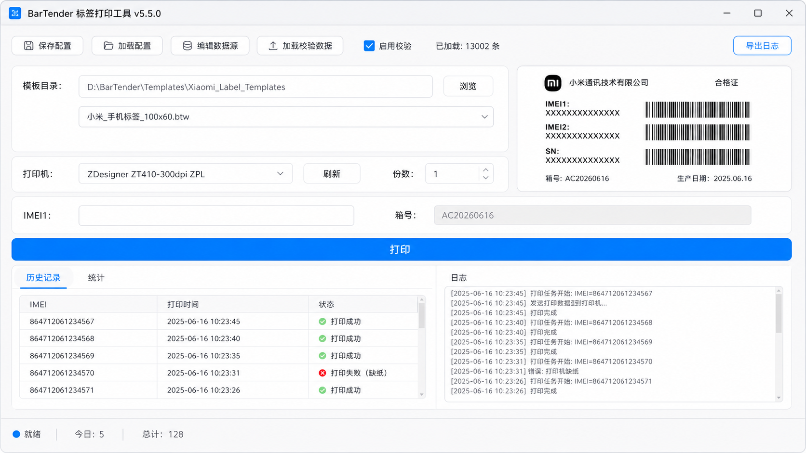

# BarTender Printer

基于 Seagull BarTender COM 接口的标签自动化打印工具，支持 .btw 模板字段自动填充、增序编号、批量数据导入、重复校验和历史追溯。



## 最新版本

**[v5.7.16](https://github.com/tall-1997/Label-Printer/releases/tag/v5.7.16)** - C# WinForms 自包含版（推荐）

## 功能特性

### 核心功能
- **模板管理**：选择模板目录，下拉框切换 .btw 模板，异步生成模板预览图
- **数据源自动检测**：自动读取 .btw 模板内的命名子字符串字段，自由勾选需要的数据源
- **动态输入框**：根据数据源配置自动生成输入框，回车跳转下一个，最后一项回车触发打印
- **打印完成后自动清空**：清空非增序字段，增序字段自动更新并锁定

### 数据源增序功能
- **自动增序/降序**：支持设置步长（+1 增序，-1 降序）
- **智能识别**：自动识别数字部分，如 `AC20260616` → `AC20260617`
- **保留前导零**：`001` → `002`
- **首次打印后锁定**：增序字段锁定为只读，后续只需输入其他字段

### 数据校验
- **重复检测**：打印前检查所有数据源值是否已打印过，弹窗显示具体重复字段
- **本地数据校验**：加载 CSV/Excel/TXT 文件作为校验数据源，支持选择列
- **校验开关**：可勾选是否启用本地数据校验

### 配置管理
- **保存/加载配置**：INI 格式保存，打印机、打印份数、数据源配置、模板目录
- **主界面直接操作**：打印机下拉框、打印份数选择框、校验数据开关

### 历史记录
- **搜索**：按 IMEI、打印时间、状态搜索
- **导出**：导出为 CSV 文件
- **统计**：今日打印数、总打印数

### 日志
- **运行日志**：所有操作自动记录到日志文件
- **导出日志**：可导出为 .log 文件方便调试
- **清空日志**：一键清空界面日志

### 离线模式
- 无 BarTender 时自动进入离线模式
- 所有非打印功能正常可用
- 手动配置数据源

## 技术方案

| 项目 | 说明 |
|------|------|
| 语言 | C# (.NET 8.0) |
| UI | WinForms + MIUIX 风格配色 |
| BarTender | COM 接口调用 |
| 打印方式 | `Formats.Open` → `SetNamedSubStringValue` → `PrintOut` |
| 预览方式 | `ExportImageToClipboard` + `ExportImageToFile` |
| 配置存储 | Windows INI 文件 |
| 历史记录 | CSV 文件 |
| 发布方式 | 自包含单文件（无需安装运行时） |

## 界面布局

```
┌──────────────────────────────────────────┐
│ BarTender 标签打印工具 v5.7.16    [导出日志]  │
│ [保存配置] [加载配置] [编辑数据源]            │
│ [加载校验数据] [✓启用校验] 已加载: N条       │
│                                            │
│ 模板目录：[D:\templates]        [浏览]      │
│ [模板下拉框]                    [预览图]    │
│                                            │
│ 打印机：[HP LaserJet        ▼] [刷新]      │
│                                    份数：[1]│
│ ┌──────────────────────────────────────┐  │
│ │ IMEI1：[________________]            │  │
│ │ 箱号：  [AC20260616]  (锁定+增序)    │  │
│ └──────────────────────────────────────┘  │
│ [打印]                                     │
│ ┌─历史记录/统计──────────────────────┐    │
│ └──────────────────────────────────────┘  │
│ ┌─日志────────────────────────────────┐  │
│ └──────────────────────────────────────┘  │
│ 就绪 | 今日: 5 | 总计: 128                 │
└──────────────────────────────────────────┘
```

## 使用流程

1. 选择模板目录 → 下拉框选择 .btw 模板
2. 自动弹出数据源选择 → 勾选需要的字段，设置显示名称和增序
3. 选择打印机（主界面下拉框）
4. 设置打印份数（主界面数字框）
5. 输入增序字段初始值（如箱号=AC20260616）
6. 在输入框中扫码/输入数据 → 回车跳转下一个
7. 最后一项回车自动打印 → 增序字段锁定并更新，其他字段清空
8. 继续扫码输入，重复打印

## 环境要求

- Windows 10/11 x64
- BarTender 2022 R2 Enterprise（Automation/Enterprise Automation 版）
- 无需安装 .NET 运行时（自包含）

## 下载

前往 [Releases](https://github.com/tall-1997/Label-Printer/releases) 页面下载最新版本。

| 版本 | 大小 | 说明 |
|------|------|------|
| [v5.7.16](https://github.com/tall-1997/Label-Printer/releases/download/v5.7.16/BarTenderPrinter.exe) | ~68 MB | 自包含版，无需安装运行时 |
| [v2.6.5](https://github.com/tall-1997/Label-Printer/releases/download/v2.6.5/bartender-printer.exe) | 38 KB | Python 版（需 Python 环境） |

## 项目结构

```
Label-Printer/
├── BarTenderPrinter/          # C# WinForms 项目
│   ├── BarTenderPrinter.csproj
│   ├── Program.cs
│   ├── MainForm.cs            # 主窗体逻辑
│   ├── MainForm.Designer.cs   # 主窗体 UI 定义
│   ├── BarTenderService.cs    # BarTender COM 调用
│   ├── HistoryManager.cs      # 历史记录管理
│   ├── LoggerService.cs       # 日志服务
│   └── MiuiTheme.cs           # MIUIX 风格主题
├── bartender_printer.py       # Python 版（v2.x）
├── label_printer.py           # 通用标签打印工具
├── assets/                    # 资源文件
│   └── preview.png            # 界面预览图
└── .github/workflows/         # GitHub Actions 自动构建和测试
    ├── build-csharp.yml       # 构建工作流
    ├── test-csharp.yml        # 自动化测试
    └── test-core.yml          # 核心功能测试
```

## 开发

### C# 版
```bash
# 使用 Visual Studio 打开
BarTenderPrinter/BarTenderPrinter.csproj

# 或使用 dotnet 命令行
dotnet publish BarTenderPrinter/BarTenderPrinter.csproj -c Release -r win-x64 --self-contained true -o publish
```

### Python 版
```bash
pip install pyinstaller pywin32 openpyxl
python bartender_printer.py
```

## 许可证

MIT License
