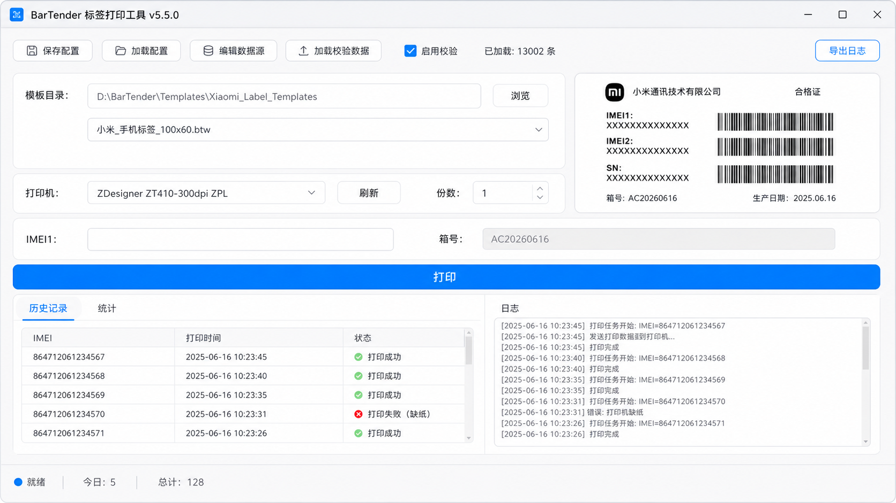

# BarTender Printer

基于 Seagull BarTender COM 接口的包装 MES 标签自动化打印工具，支持订单管理、.btw 模板字段自动填充、右键打开模板、增降序锁定、历史字段导入、补打印、重复校验和历史追溯。



## 最新版本

**v5.7.58** - C# WinForms 安装版

## 功能特性

### 核心功能
- **订单管理页面**：按客户、机型、颜色、订单号选择包装订单并调用绑定配置
- **添加订单**：新增订单时填写可复用客户、机型、颜色和唯一订单号，页面内平铺配置模板和数据源
- **多模板订单**：一个订单可绑定多个模板，每个模板独立保存数据源、打印机、份数、锁定和增降序设置
- **模板绝对路径**：订单直接引用操作员选择的 .btw 模板完整路径，编辑与打印读取同一模板文件
- **模板更新检测**：切换订单模板或进入打印页面时核对外部模板，更新后由操作员选择外部新版或当前归档版
- **模板管理**：选择模板目录，下拉框切换 .btw 模板，异步生成模板预览图
- **右键打开模板**：安装后可在 `.btw` 文件右键菜单选择“使用 BarTenderPrinter 打开”并自动加载模板
- **数据源自动检测**：自动读取 .btw 模板内的命名子字符串字段，自由勾选、拖拽排序并设置长度规则
- **动态输入框**：根据数据源配置自动生成输入框，右侧锁图标支持固定锁定和增降序锁定
- **打印完成后自动清空**：清空非增序字段，增序字段自动更新并锁定

### 数据源增序功能
- **自动增序/降序**：支持设置步长（+1 增序，-1 降序）
- **智能识别**：自动识别数字部分，如 `AC20260616` → `AC20260617`
- **保留前导零**：`001` → `002`
- **待打印值恢复**：历史导入或补打印旧编号后自动恢复到已保存的下一条待打印编号
- **锁定图标**：输入完成后点击锁图标，普通字段固定锁定，增降序字段按增降序锁定

### 数据校验
- **重复检测**：打印前检查所有数据源值是否已打印过，弹窗显示具体重复字段
- **本地数据校验**：加载 CSV/Excel/TXT 文件作为校验数据源，支持选择列
- **校验开关**：可勾选是否启用本地数据校验

### 配置管理
- **保存/加载配置**：INI 和模板级 JSON 保存打印机、打印份数、数据源配置、模板目录
- **模板级配置**：订单内各模板独立保存数据源顺序、锁定值、增降序待打印值、长度规则、打印机和份数
- **主界面直接操作**：打印机下拉框、打印份数选择框、校验数据开关、长度校验开关

### 历史记录
- **搜索**：按字段名、字段值、模板、时间、状态、打印机和份数搜索
- **导入**：从历史记录选择部分字段导入到当前输入框
- **补打印**：使用历史字段快照补打印，并可选择本次打印机
- **删除**：历史记录支持右键删除单条打印记录
- **导出**：按当前模板和搜索结果导出为 CSV 文件
- **统计**：今日打印数、总打印数

### 日志
- **运行日志**：所有操作自动记录到日志文件
- **导出日志**：可导出为 .log 文件方便调试
- **清空日志**：一键清空界面日志

### 离线模式
- 无 BarTender 时自动进入离线模式
- 所有非打印功能正常可用
- 手动配置数据源

## 技术方案

| 项目 | 说明 |
|------|------|
| 语言 | C# (.NET 8.0) |
| UI | WinForms + MIUIX 风格配色 |
| BarTender | COM 接口调用 |
| 打印方式 | `Formats.Open` → `SetNamedSubStringValue` → `PrintOut` |
| 预览方式 | `ExportImageToClipboard` + `ExportImageToFile` |
| 配置存储 | Windows INI 文件 |
| 历史记录 | CSV 文件 |
| 发布方式 | Inno Setup 当前用户安装包（内置 .NET 运行时） |

## 界面布局

```
┌──────────────────────────────────────────┐
│ BarTender 标签打印工具 v5.7.58    [导出日志]  │
│ [保存配置] [加载配置] [编辑数据源]            │
│ [加载校验数据] [✓启用校验] 已加载: N条       │
│                                            │
│ 模板目录：[D:\templates]        [浏览]      │
│ [模板下拉框]                    [预览图]    │
│                                            │
│ 打印机：[HP LaserJet        ▼] [刷新]      │
│                                    份数：[1]│
│ ┌──────────────────────────────────────┐  │
│ │ IMEI1：[________________]            │  │
│ │ 箱号：  [AC20260616]  (锁定+增序)    │  │
│ └──────────────────────────────────────┘  │
│ [打印]                                     │
│ ┌─历史记录/统计──────────────────────┐    │
│ └──────────────────────────────────────┘  │
│ ┌─日志────────────────────────────────┐  │
│ └──────────────────────────────────────┘  │
│ 就绪 | 今日: 5 | 总计: 128                 │
└──────────────────────────────────────────┘
```

## 使用流程

1. 选择模板目录 → 下拉框选择 .btw 模板
2. 点击“添加订单” → 填写客户、机型、颜色、订单号并添加一个或多个模板
3. 切换订单模板，在页面内配置各模板的数据源、锁定、增降序、长度、打印机和份数
4. 在“订单管理”页面选择客户、机型、颜色、订单号
5. 选择打印机（主界面下拉框）
6. 设置打印份数（主界面数字框）
7. 输入增序字段初始值（如箱号=AC20260616）
8. 在输入框中扫码/输入数据 → 回车跳转下一个
9. 最后一项回车自动打印 → 增序字段更新待打印值，其他字段清空
10. 继续扫码输入，重复打印
11. 需要复用历史数据时，在历史记录中选择记录并点击“导入”或“补打印选中项”
12. 需要直接打开模板时，右键 `.btw` 文件选择“使用 BarTenderPrinter 打开”

> Windows 11 可能需要先点击“显示更多选项”，再选择“使用 BarTenderPrinter 打开”。

## 环境要求

- Windows 10/11 x64
- BarTender 2022 R2 Enterprise（Automation/Enterprise Automation 版）
- 安装包内置 .NET 运行时

## 下载

前往 [Releases](https://github.com/tall-1997/Label-Printer/releases) 页面下载最新版本。

| 版本 | 大小 | 说明 |
|------|------|------|
| [v5.7.58](https://github.com/tall-1997/Label-Printer/releases/tag/v5.7.58) | ~49 MB | 订单级联和锁定步长修复版 |
| [v5.7.57](https://github.com/tall-1997/Label-Printer/releases/tag/v5.7.57) | ~49 MB | 订单管理交互和账户登录修复版 |
| [v5.7.56](https://github.com/tall-1997/Label-Printer/releases/tag/v5.7.56) | ~49 MB | SQLite 迁移闭环与审计强化版 |
| [v5.7.55](https://github.com/tall-1997/Label-Printer/releases/tag/v5.7.55) | ~49 MB | SQLite 历史主存储与审计增强版 |
| [v5.7.54](https://github.com/tall-1997/Label-Printer/releases/tag/v5.7.54) | ~49 MB | JSONL 历史反序列化修复版 |
| [v5.7.53](https://github.com/tall-1997/Label-Printer/releases/tag/v5.7.53) | ~49 MB | 历史可靠性和测试隔离增强版 |
| [v5.7.52](https://github.com/tall-1997/Label-Printer/releases/tag/v5.7.52) | ~49 MB | UI 交互优化与测试保障版 |
| [v5.7.51](https://github.com/tall-1997/Label-Printer/releases/tag/v5.7.51) | ~49 MB | 数据模型升级与 JSONL 历史版 |
| [v5.7.50](https://github.com/tall-1997/Label-Printer/releases/tag/v5.7.50) | ~49 MB | 架构重构基础设施版 |
| [v5.7.49](https://github.com/tall-1997/Label-Printer/releases/tag/v5.7.49) | ~49 MB | P2 体验与审计增强版 |
| [v5.7.48](https://github.com/tall-1997/Label-Printer/releases/tag/v5.7.48) | ~49 MB | P1 数据校验与历史稳定性修复版 |
| [v5.7.47](https://github.com/tall-1997/Label-Printer/releases/tag/v5.7.47) | ~49 MB | P0 打印安全校验修复版 |
| [v5.7.45](https://github.com/tall-1997/Label-Printer/releases/tag/v5.7.45) | ~49 MB | 数据源表格批量选择和步长合并版 |
| [v5.7.44](https://github.com/tall-1997/Label-Printer/releases/tag/v5.7.44) | ~49 MB | 打印页订单级联选择和锁定图标优化版 |
| [v5.7.43](https://github.com/tall-1997/Label-Printer/releases/tag/v5.7.43) | ~49 MB | 订单草稿和打印回调编译修复版 |
| [v5.7.42](https://github.com/tall-1997/Label-Printer/releases/tag/v5.7.42) | ~49 MB | 订单草稿放弃和打印回调安全修复版 |
| [v5.7.41](https://github.com/tall-1997/Label-Printer/releases/tag/v5.7.41) | ~49 MB | BarTender STA 调用和历史一致性修复版 |
| [v5.7.40](https://github.com/tall-1997/Label-Printer/releases/tag/v5.7.40) | ~49 MB | 打印页布局重排和退出确认版 |
| [v5.7.39](https://github.com/tall-1997/Label-Printer/releases/tag/v5.7.39) | ~49 MB | 打印页只读配置和订单选择状态修复版 |
| [v5.7.38](https://github.com/tall-1997/Label-Printer/releases/tag/v5.7.38) | ~49 MB | 订单管理长度覆盖、未保存提示和锁定按钮版 |
| [v5.7.37](https://github.com/tall-1997/Label-Printer/releases/tag/v5.7.37) | ~49 MB | 订单管理数据源明细和长度校验修复版 |
| [v5.7.36](https://github.com/tall-1997/Label-Printer/releases/tag/v5.7.36) | ~49 MB | 订单模板校验数据持久化和内置侧栏图标版 |
| [v5.7.35](https://github.com/tall-1997/Label-Printer/releases/tag/v5.7.35) | ~49 MB | 侧边栏折叠、校验导入和重复校验性能优化版 |
| [v5.7.34](https://github.com/tall-1997/Label-Printer/releases/tag/v5.7.34) | ~49 MB | 模板绝对路径、历史导入补录和订单模板维护版 |
| [v5.7.33](https://github.com/tall-1997/Label-Printer/releases/tag/v5.7.33) | ~49 MB | 添加模板时数据源单元格崩溃修复版 |
| [v5.7.32](https://github.com/tall-1997/Label-Printer/releases/tag/v5.7.32) | ~49 MB | 订单编辑状态、布局冲突和界面可读性修复版 |
| [v5.7.31](https://github.com/tall-1997/Label-Printer/releases/tag/v5.7.31) | ~49 MB | 订单完整设置平铺编辑版 |
| [v5.7.30](https://github.com/tall-1997/Label-Printer/releases/tag/v5.7.30) | ~49 MB | 多模板订单、模板更新检测和页面布局修复版 |
| [v5.7.29](https://github.com/tall-1997/Label-Printer/releases/tag/v5.7.29) | ~49 MB | C# WinForms 当前用户安装版 |
| [v5.7.28](https://github.com/tall-1997/Label-Printer/releases/tag/v5.7.28) | ~49 MB | 订单添加页面内嵌数据源设置版 |
| [v5.7.27](https://github.com/tall-1997/Label-Printer/releases/tag/v5.7.27) | ~49 MB | 包装 MES 订单管理初版 |
| [v5.7.26](https://github.com/tall-1997/Label-Printer/releases/tag/v5.7.26) | ~49 MB | 打印流程健壮性修复版 |
| [v5.7.25](https://github.com/tall-1997/Label-Printer/releases/tag/v5.7.25) | ~49 MB | 历史右键和模板菜单修复版 |
| [v5.7.24](https://github.com/tall-1997/Label-Printer/releases/tag/v5.7.24) | ~49 MB | 右键打开模板和历史单条删除版 |
| [v5.7.23](https://github.com/tall-1997/Label-Printer/releases/tag/v5.7.23) | ~49 MB | 数据源锁定工作流优化版 |
| [v5.7.18](https://github.com/tall-1997/Label-Printer/releases/tag/v5.7.18) | ~155 MB | 历史自包含单文件版 |
| [v2.6.5](https://github.com/tall-1997/Label-Printer/releases/download/v2.6.5/bartender-printer.exe) | 38 KB | Python 版（需 Python 环境） |

## 项目结构

```
Label-Printer/
├── BarTenderPrinter/          # C# WinForms 项目
│   ├── BarTenderPrinter.csproj
│   ├── Program.cs
│   ├── MainForm.cs            # 主窗体逻辑
│   ├── MainForm.Designer.cs   # 主窗体 UI 定义
│   ├── BarTenderService.cs    # BarTender COM 调用
│   ├── HistoryManager.cs      # 历史记录管理
│   ├── TemplateSettingsManager.cs # 模板级设置管理
│   ├── OrderManager.cs        # 包装订单和模板归档管理
│   ├── LoggerService.cs       # 日志服务
│   └── MiuiTheme.cs           # MIUIX 风格主题
├── bartender_printer.py       # Python 版（v2.x）
├── label_printer.py           # 通用标签打印工具
├── assets/                    # 资源文件
│   └── preview.png            # 界面预览图
└── .github/workflows/         # GitHub Actions 自动构建和测试
    ├── build-csharp.yml       # 构建工作流
    ├── test-csharp.yml        # 自动化测试
    └── test-core.yml          # 核心功能测试
```

## 开发

### C# 版
```bash
# 使用 Visual Studio 打开
BarTenderPrinter/BarTenderPrinter.csproj

# 或使用 dotnet 命令行
dotnet publish BarTenderPrinter/BarTenderPrinter.csproj -c Release -r win-x64 --self-contained true -o publish

# 使用 Inno Setup 6 构建当前用户安装包
iscc installer/BarTenderPrinter.iss
```

### Python 版
```bash
pip install pyinstaller pywin32 openpyxl
python bartender_printer.py
```

## 许可证

MIT License
